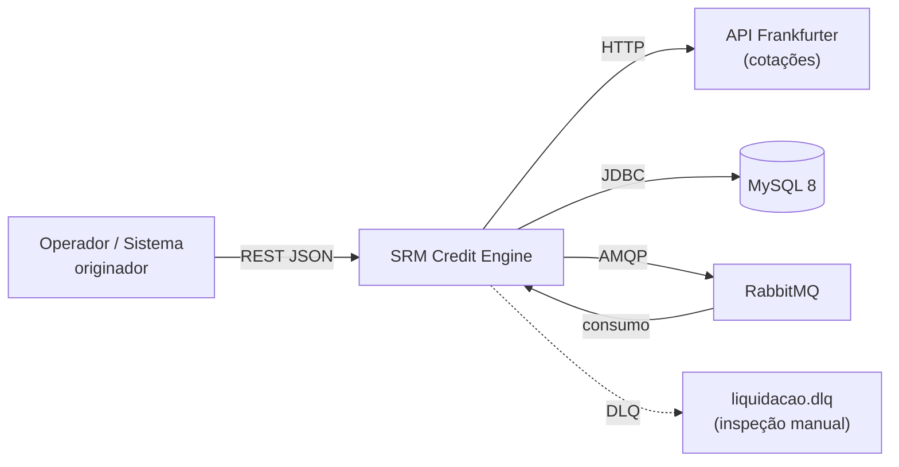
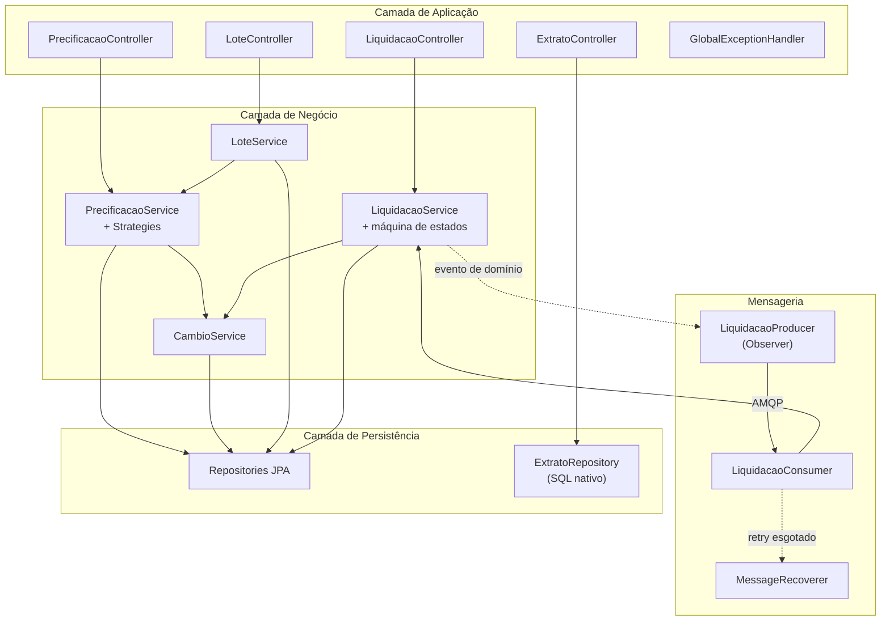
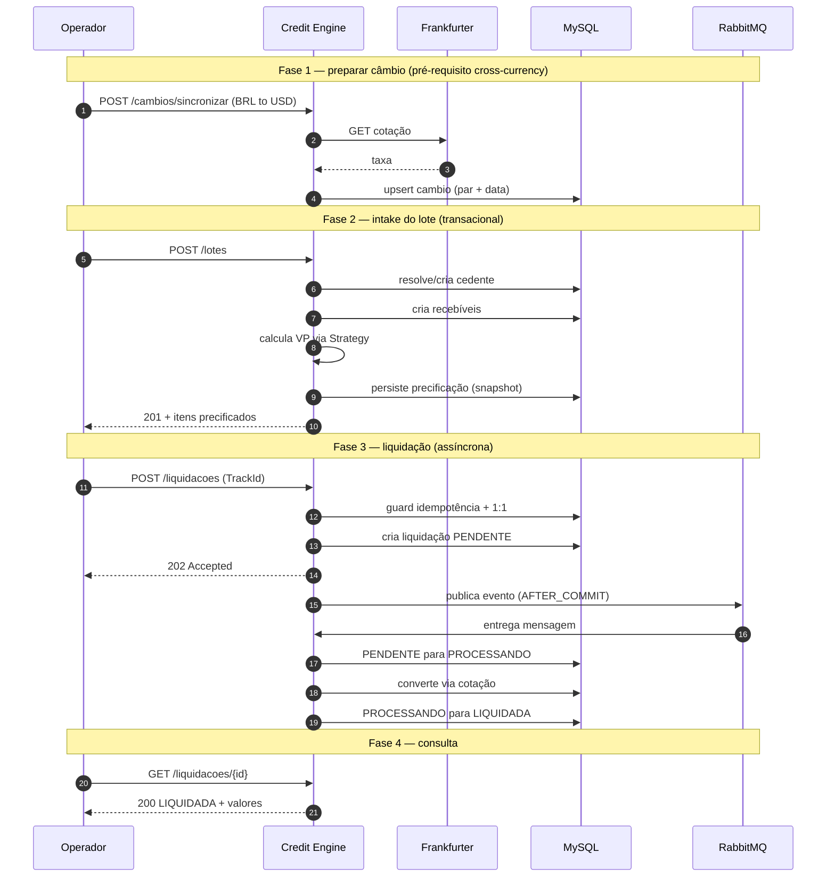
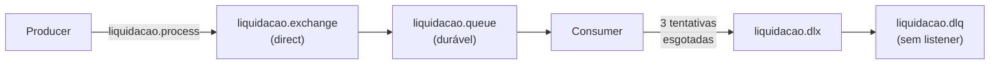
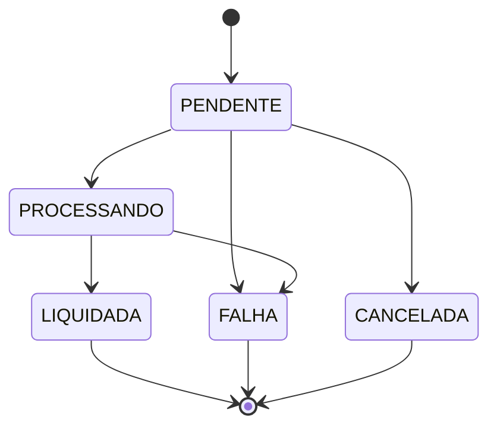
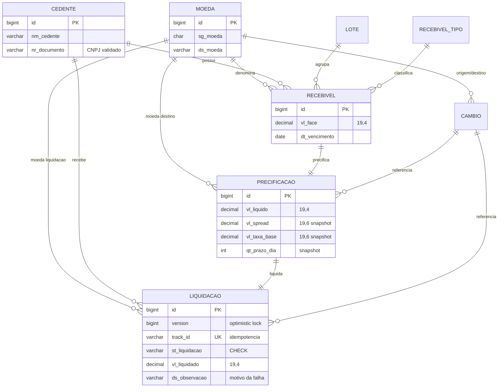
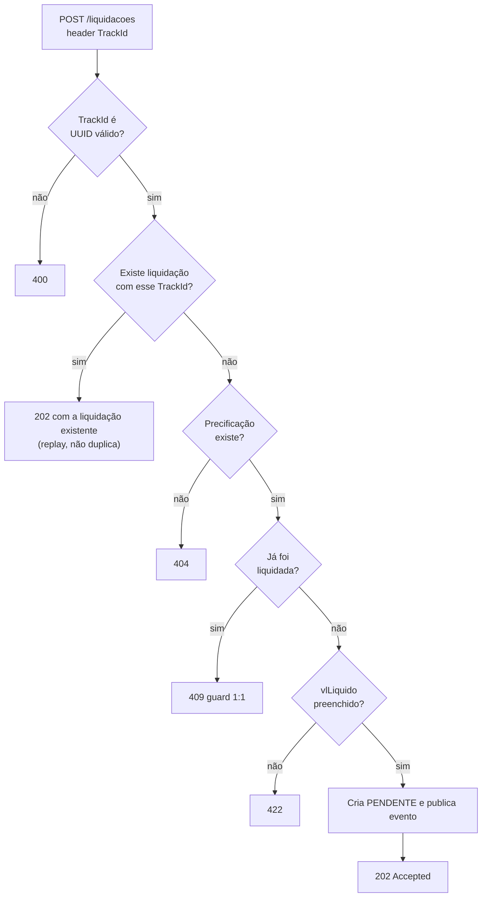
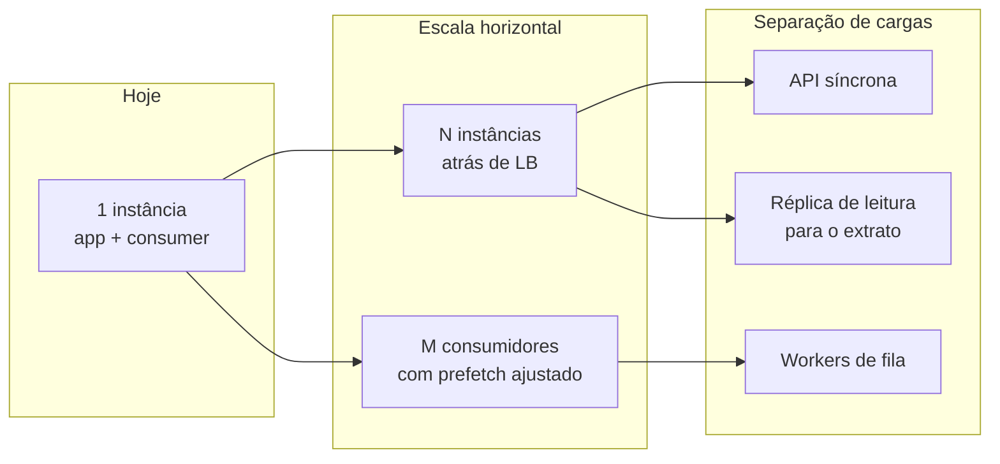
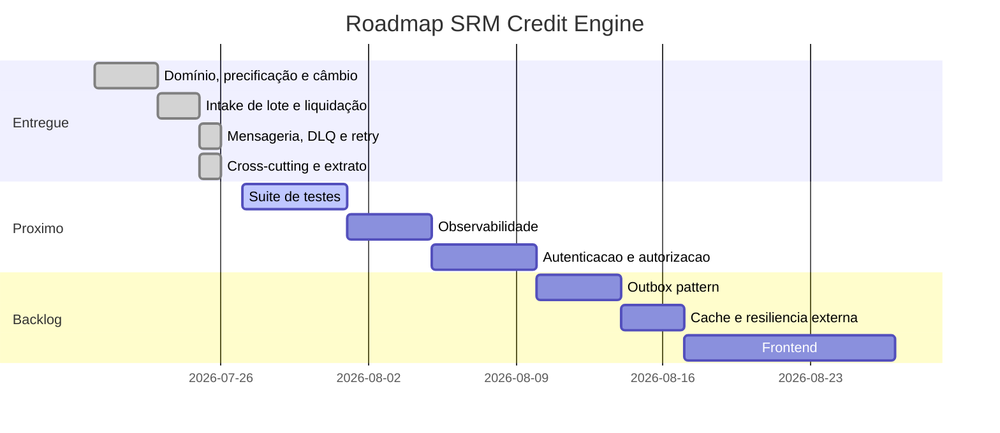

# SRM Credit Engine

> Plataforma de cessão de crédito de recebíveis multimoedas — precificação com risco, conversão cambial e liquidação financeira assíncrona.

**SRM Asset** · Mercado Financeiro / FIDC


---

## Índice

| | | |
|---|---|---|
| [1. Introdução](#1-introdução) | [11. RabbitMQ](#11-rabbitmq) | [21. Fluxos](#21-fluxos) |
| [2. Contexto de Negócio](#2-contexto-de-negócio) | [12. Banco de Dados](#12-banco-de-dados) | [22. Segurança](#22-segurança) |
| [3. Objetivo](#3-objetivo) | [13. Docker](#13-docker) | [23. Performance](#23-performance) |
| [4. Escopo](#4-escopo) | [14. Estrutura de diretórios](#14-estrutura-de-diretórios) | [24. Escalabilidade](#24-escalabilidade) |
| [5. Arquitetura](#5-arquitetura) | [15. Como executar](#15-como-executar-local) | [25. Melhorias Futuras](#25-melhorias-futuras) |
| [6. Tecnologias](#6-tecnologias) | [16. Executar com Docker](#16-como-executar-com-docker) | [26. Roadmap](#26-roadmap) |
| [7. Justificativa das tecnologias](#7-justificativa-de-cada-tecnologia) | [17. Swagger](#17-swagger--openapi) | [27. ADR](#27-adr--architecture-decision-records) |
| [8. Fluxo da aplicação](#8-fluxo-da-aplicação) | [18. Collection Postman](#18-collection-postman) | [28. AI Usage](#28-ai-usage) |
| [9. Arquitetura em camadas](#9-arquitetura-em-camadas) | [19. Testes](#19-testes) | [29. Licença](#29-licença) |
| [10. Strategy Pattern](#10-strategy-pattern) | [20. Diagramas](#20-diagramas) | [30. Autor](#30-autor) |

**Processo de engenharia:** [Branching](#estratégia-de-branching) · [Conventional Commits](#convenção-de-commits-conventional-commits) · [Proteção da `main`](#proteção-da-branch-main) · [Padronização de código](#padronização-de-código-e-git-hooks) · [CI/CD](#cicd) · [Versionamento](#versionamento)

---

## 1. Introdução

O **SRM Credit Engine** é o motor de crédito responsável por transformar recebíveis financeiros em caixa antecipado. Ele recebe títulos (duplicatas mercantis e cheques pré-datados), calcula o deságio considerando o risco do ativo, aplica conversão cambial quando a liquidação ocorre em moeda diferente da do título, e processa a liquidação de forma assíncrona.

O sistema foi construído sobre três invariantes que orientam todas as decisões de design:

1. **Dinheiro não se perde e não se duplica.** Toda operação de escrita multi-etapa é transacional; a liquidação é idempotente por chave de rastreio e protegida por *optimistic locking*.
2. **O histórico é imutável.** A precificação congela um *snapshot* do spread, da taxa base e do prazo. Mudança futura de política comercial não reescreve cálculo passado.
3. **Falha nunca é silenciosa.** Erro de negócio é registrado com motivo auditável; falha inesperada vai para *dead letter queue* com diagnóstico, nunca é descartada.

---

## 2. Contexto de Negócio

### O problema

Um **cedente** (empresa fornecedora) possui recebíveis a vencer — duplicatas de vendas a prazo, cheques pré-datados. Esse dinheiro existe no papel, mas não no caixa. A operação de **cessão de crédito** antecipa esse valor: a instituição compra o direito de recebimento pagando hoje um valor menor que o de face. A diferença é o **deságio**, que remunera o custo de capital e o risco do ativo.

### Conceitos do domínio

| Termo | Significado no sistema |
|---|---|
| **Cedente** | Empresa que cede os recebíveis. Identificada por CNPJ (validado). |
| **Recebível** | Título a vencer: valor de face, vencimento, tipo e moeda. |
| **Lote** | Agrupamento de recebíveis submetidos numa mesma operação de intake. |
| **Valor de face** (`vl_face`) | Valor nominal do título no vencimento. |
| **Valor líquido** (`vl_liquido`) | Valor presente após o deságio — o que o cedente efetivamente recebe. |
| **Taxa base** (`vl_taxa_base`) | Custo de capital do mercado no momento do intake. Informada por lote. |
| **Spread** (`vl_spread`) | Prêmio de risco, definido **por tipo de recebível**. |
| **Prazo** (`qt_prazo_dia`) | Dias entre a criação e o vencimento do título. |
| **Precificação** | Resultado do cálculo, com snapshot histórico dos parâmetros. |
| **Liquidação** | Movimento financeiro que efetiva a cessão, possivelmente em outra moeda. |
| **Cross-currency** | Título em uma moeda, pagamento em outra — exige cotação sincronizada. |

### Por que o risco muda o preço

Nem todo recebível vale o mesmo. Uma **duplicata mercantil** é lastreada numa transação comercial com nota fiscal — risco menor. Um **cheque pré-datado** depende da liquidez de um sacado pessoa física, sem lastro documental equivalente — risco maior. O sistema traduz essa diferença em spread:

| Tipo de recebível | Spread mensal | Racional |
|---|---|---|
| `DUPLICATA_MERCANTIL` | **1,5% a.m.** | Lastro em operação comercial documentada |
| `CHEQUE_PRE_DATADO` | **2,5% a.m.** | Risco de crédito do sacado, sem lastro equivalente |

### A fórmula

```
                    VF
VP = ────────────────────────────────
     (1 + TaxaBase + Spread) ^ Prazo
```

Onde `VF` é o valor de face, `Prazo` está em meses (dias ÷ 30) e as taxas são mensais. É desconto composto: quanto mais longe o vencimento, maior o deságio.

**Exemplo.** Duplicata de R$ 10.000,00 vencendo em 87 dias (2,9 meses), taxa base de 1% a.m.:

```
VP = 10.000 / (1 + 0,01 + 0,015) ^ 2,9  =  R$ 9.308,95
```

O mesmo título como cheque pré-datado, com spread de 2,5%: **R$ 9.050,51**. O risco adicional custa R$ 258,44 ao cedente.

---

## 3. Objetivo

Entregar um motor de crédito que atenda simultaneamente a três exigências que frequentemente entram em conflito:

| Exigência | Como é atendida |
|---|---|
| **Correção financeira** | `BigDecimal` em toda aritmética monetária, com `precision`/`scale` explícitos e `RoundingMode.HALF_EVEN`. Nunca `double` para dinheiro. |
| **Rastreabilidade / auditoria** | Snapshot imutável dos parâmetros de cálculo, chave de idempotência por operação, máquina de estados explícita, motivo de falha persistido. |
| **Resiliência operacional** | Liquidação assíncrona com retry limitado e *backoff*, DLQ para falha definitiva, consumidor idempotente. |

O objetivo **não** é maximizar features, e sim demonstrar que cada decisão foi tomada com consciência do trade-off — o que é o critério real de senioridade em sistemas financeiros.

---

## 4. Escopo

### Dentro do escopo (implementado)

- ✅ Simulação de deságio sem persistência (`POST /precificacoes/simular`)
- ✅ Sincronização e consulta de cotações via API externa (Frankfurter), com taxa inversa
- ✅ Intake de lote: resolução de cedente, criação de recebíveis, precificação persistida com snapshot
- ✅ Liquidação idempotente, assíncrona, com máquina de estados
- ✅ Consulta de estado da liquidação (contrapartida do `202`)
- ✅ Extrato analítico com filtros combináveis, paginação *server-side* e ordenação restrita
- ✅ Tratamento global de exceções com status HTTP semânticos
- ✅ DLQ e retry limitado com *backoff* exponencial
- ✅ Documentação OpenAPI navegável
- ✅ Containerização completa (app + MySQL + RabbitMQ)

### Fora do escopo (decisão consciente)

| Item | Por que ficou fora |
|---|---|
| Autenticação / autorização | Requer decisão de infraestrutura (provider OAuth2, gateway) que extrapola o núcleo de domínio. Ver [§22](#22-segurança). |
| Frontend (SPA) | O contrato REST está fechado e documentado; a UI é consumidor, não pré-requisito. |
| Testes automatizados | **Pendência reconhecida** — priorização de escopo. Ver [§19](#19-testes). |
| Observabilidade (métricas/tracing) | Ver [§25](#25-melhorias-futuras). |
| Outbox pattern | Mitigação e trade-off em [ADR-008](#adr-008--publicação-de-evento-após-commit-em-vez-de-outbox). |

---

## 5. Arquitetura

### Visão de contexto



### Visão de componentes



### Princípios estruturais

**Fluxo síncrono para o que o cliente precisa saber agora; assíncrono para o que pode esperar.** A criação da liquidação valida, persiste e responde em milissegundos. A conversão cambial — que depende de I/O externo — roda fora do ciclo de request.

**O domínio não conhece a infraestrutura de mensageria.** `LiquidacaoService` publica um evento de domínio via `ApplicationEventPublisher`; quem traduz isso para AMQP é um listener dedicado. Nenhum `RabbitTemplate` dentro de `service/impl`. Ver [§10](#10-strategy-pattern) e [ADR-003](#adr-003--observer-para-desacoplar-domínio-e-broker).

**Relatório não passa por service.** O extrato é leitura agregada sem regra de negócio; interpor uma camada seria repasse vazio. Exceção documentada em [ADR-006](#adr-006--2-camadas-e-sql-nativo-no-extrato).

---

## 6. Tecnologias

| Tecnologia | Versão | Papel |
|---|---|---|
| **Java** | 17 (LTS) | Linguagem base |
| **Spring Boot** | 4.1.0 | Framework de aplicação |
| **Spring Web MVC** | 7.0.8 | Camada REST |
| **Spring Data JPA** | — | Persistência (Hibernate 7) |
| **Spring AMQP** | 4.1.0 | Integração RabbitMQ |
| **MySQL** | 8.0 | Banco relacional |
| **Flyway** | — | Versionamento de schema |
| **RabbitMQ** | 3 (management) | Broker de mensageria |
| **springdoc-openapi** | 2.8.6 | OpenAPI 3.1 + Swagger UI |
| **Lombok** | — | Redução de boilerplate |
| **MapStruct** | 1.6.3 | Infra de mapeamento |
| **Jackson** | 3.1.4 | Serialização JSON |
| **Hibernate Validator** | — | Bean Validation (inclui `@CNPJ`) |
| **Docker / Compose** | — | Containerização |
| **Maven** | 3.9 | Build |
| **Spotless** | 2.44.5 | Linter / formatador (palantir-java-format 2.68.0) |
| **JaCoCo** | 0.8.13 | Cobertura de testes (unitários + integração) |
| **pre-commit** | — | Git hooks (`pre-commit` e `pre-push`) |
| **GitHub Actions** | — | Pipeline de CI |

---

## 7. Justificativa de cada tecnologia

**Java 17** — LTS com suporte estendido, `record`, *pattern matching* para `instanceof`, *text blocks* (usados no SQL do extrato e nas descrições OpenAPI) e *switch expressions* (máquina de estados). É a versão que a maioria das instituições financeiras roda em produção hoje.

**Spring Boot** — gerencia o ciclo de vida transacional (`@Transactional`), a infraestrutura de mensageria com retry/recoverer e a injeção por construtor. Em domínio financeiro, ter controle transacional declarativo e testado pelo framework vale mais que qualquer ganho de controle manual.

**Spring Data JPA** — o domínio tem 8 entidades com relacionamentos densos; mapeamento objeto-relacional evita SQL manual para CRUD. **Onde o ORM não serve, ele é abandonado**: o extrato usa SQL nativo (ADR-006). `open-in-view=false` para forçar decisões explícitas de carregamento.

**MySQL 8** — banco relacional com transações ACID reais, `CHECK constraints`, `DECIMAL` exato e *optimistic locking* por coluna de versão. Dados financeiros exigem integridade referencial e transação — não é caso de NoSQL.

**Flyway** — schema é código versionado. `ddl-auto=validate` impede o Hibernate de gerar DDL: se a entidade divergir do schema, a aplicação **não sobe**. Migration aplicada nunca é editada.

**RabbitMQ** — desacopla a criação da liquidação do seu processamento. Traz o que importa aqui: fila durável, *dead letter exchange* nativa, controle de ack e painel de inspeção. Kafka seria sobre-engenharia para um fluxo sem *event sourcing* nem *replay* histórico.

**Docker / Compose** — sobe MySQL + RabbitMQ + aplicação com healthcheck e ordem de dependência. Elimina "na minha máquina funciona".

**springdoc-openapi** — gera OpenAPI 3.1 a partir das anotações, mantendo a documentação sincronizada com o código. Ver ressalva de compatibilidade em [§17](#17-swagger--openapi).

**Lombok** — elimina getters/setters/construtores das entidades. Usado com moderação: `@RequiredArgsConstructor` para injeção, `@Getter`/`@Setter` nas entidades. Nenhum `@Data` em entidade — evita `equals`/`hashCode` sobre coleções LAZY.

**Bean Validation** — validação declarativa na fronteira. O `@CNPJ` do Hibernate Validator valida dígito verificador, não apenas formato.

**JUnit / Mockito** — dependências presentes no `pom.xml`. Ver [§19](#19-testes) para o estado real da cobertura.

---

## 8. Fluxo da aplicação

### Contrato REST

| Método | Rota | Status | Descrição |
|---|---|---|---|
| `POST` | `/api/v1/precificacoes/simular` | `200` | Simula deságio sem persistir |
| `POST` | `/api/v1/cambios/sincronizar` | `201` | Busca e persiste cotação (upsert por par + data) |
| `GET` | `/api/v1/cambios` | `200` | Última cotação do par, com taxa inversa |
| `POST` | `/api/v1/lotes` | `201` | Intake: cedente + recebíveis + precificações |
| `POST` | `/api/v1/liquidacoes` | `202` | Enfileira liquidação (idempotente por `TrackId`) |
| `GET` | `/api/v1/liquidacoes/{id}` | `200` | Estado atual da liquidação |
| `GET` | `/api/v1/liquidacoes/extrato` | `200` | Extrato paginado com filtros |

### Jornada completa



---

## 9. Arquitetura em camadas

```
┌─────────────────────────────────────────────────────────┐
│  controller/          REST · @Valid · status semântico  │
│  exception/           @RestControllerAdvice global      │
├─────────────────────────────────────────────────────────┤
│  service/             interfaces de negócio             │
│  service/impl/        implementações @Service           │
│  service/strategy/    strategies de precificação        │
│  messaging/           producer (Observer) · consumer    │
├─────────────────────────────────────────────────────────┤
│  repository/          Spring Data JPA · DAO nativo      │
│  entity/  enums/      modelo de domínio persistente     │
└─────────────────────────────────────────────────────────┘
        dto/rq · dto/rs · dto/message · mapper/
        (atravessam as camadas, nunca a entity)
```

### Regras aplicadas

| Regra | Implementação |
|---|---|
| Controller nunca acessa repository nem entity | Exceção única e documentada: extrato (ADR-006) |
| Entity nunca sai na resposta | Todo retorno é DTO `...RS`; evita *mass assignment* e vazamento de `version`/LAZY |
| Request valida na fronteira | `@Valid` + Bean Validation nos DTOs `...RQ` |
| Injeção por construtor, contra a interface | `@RequiredArgsConstructor` + tipo da interface |
| Escrita multi-etapa é transacional | `@Transactional` em intake e liquidação |
| Leitura é `readOnly` | Inclui o `GET /{id}`, onde o mapper toca relação LAZY |

### Convenção de nomenclatura de colunas

Prefixos padronizados no banco: `id`, `vl_` (valor), `dt_` (data), `sg_` (sigla), `ds_` (descrição), `qt_` (quantidade), `nr_` (número), `nm_` (nome), `st_` (status).

---

## 10. Strategy Pattern

O padrão resolve uma pergunta concreta: **onde mora o spread de cada tipo de recebível?**

### A decisão

O spread mora **no código, dentro da strategy**. A fórmula do valor presente mora **no service**, uma única vez. Assim, adicionar um tipo de recebível não duplica a fórmula, e mudar a fórmula não exige tocar em cada tipo.

```java
public interface PrecificacaoStrategy {
    BigDecimal calcular(BigDecimal vlFace, BigDecimal vlTaxaBase, long qtPrazoDias);
    BigDecimal getSpread();
}
```

| Implementação | Spread |
|---|---|
| `DuplicataMercantilStrategy` | `0.015` |
| `ChequePreDatadoStrategy` | `0.025` |

### Por que `getSpread()` existe

Sem ele, o service calcula o valor presente mas **não sabe qual spread foi aplicado** — e portanto não consegue congelá-lo na `Precificacao`. O snapshot histórico ficaria incompleto: seria impossível auditar, meses depois, com que prêmio de risco um título foi precificado. `getSpread()` é o que torna a regra de imutabilidade cumprível.

### Resolução e falha

```java
private final Map<String, PrecificacaoStrategy> precificacaoStrategyMap = Map.of(
        "DUPLICATA_MERCANTIL", new DuplicataMercantilStrategy(),
        "CHEQUE_PRE_DATADO", new ChequePreDatadoStrategy()
);
```

Tipo sem strategy lança `PrecificacaoException` → **422**. Nunca `NullPointerException`: falha de configuração de produto é erro de negócio comunicável, não bug.

### Padrão Observer

O segundo padrão do projeto desacopla domínio e broker:

```
LiquidacaoServiceImpl              LiquidacaoProducer              LiquidacaoConsumer
  publishEvent(mensagem) ──► @TransactionalEventListener ──► @RabbitListener
                              (phase = AFTER_COMMIT)            processa + finaliza
```

O `AFTER_COMMIT` é a parte crítica: a mensagem só sai **depois** do commit. Sem isso, o consumidor poderia ler um registro que ainda não existe — ou que sofreu rollback.

---

## 11. RabbitMQ

### Topologia



A fila principal declara `x-dead-letter-exchange` apontando para a DLX. A **DLQ não tem listener de propósito** — a mensagem fica retida para inspeção e *replay* manual pelo painel, com o motivo nos headers `x-exception-message` e `x-exception-stacktrace`.

### Classificação da falha

A decisão central do consumidor é **distinguir falha determinística de falha transitória**:

| Natureza | Tratamento | Racional |
|---|---|---|
| `ErroDeNegocio` (moeda sem cotação, precificação sem valor líquido) | Registra `FALHA` e confirma (ack) | Retentar não muda o resultado. Gastar 3 tentativas com backoff num erro que só some com intervenção humana é desperdício. |
| Qualquer outra (banco indisponível, timeout) | **Relança** → retry → DLQ se esgotar | Pode ser transitória; merece nova tentativa. |

### Configuração de retry

```properties
spring.rabbitmq.listener.simple.default-requeue-rejected=false
spring.rabbitmq.listener.simple.retry.enabled=true
spring.rabbitmq.listener.simple.retry.max-retries=2
spring.rabbitmq.listener.simple.retry.initial-interval=1s
spring.rabbitmq.listener.simple.retry.multiplier=2
spring.rabbitmq.listener.simple.retry.max-interval=10s
```

> **Duas armadilhas documentadas:**
>
> **1. `default-requeue-rejected=false` é obrigatório.** Sem ele, mensagem rejeitada volta para a fila original em vez de ir para a DLX — falha permanente vira **loop infinito** de reprocessamento.
>
> **2. A propriedade é `max-retries`, não `max-attempts`.** No Spring Boot 4, `max-attempts` está deprecada em nível **`error`** e é **ignorada em silêncio**. E `max-retries` conta *retentativas*: o valor `2` significa 1 entrega inicial + 2 retentativas = **3 execuções**.

### Idempotência do consumidor

`processaLiquidacao` só avança quem está em `PENDENTE`. O guard ingênuo (`if status == LIQUIDADA return`) permitia que uma mensagem duplicada reentrasse num `PROCESSANDO` e disparasse **conversão de câmbio em dobro**.

`registrarFalha` **deliberadamente não lança** em transição inválida — apenas registra em log e retorna. Ele roda dentro do `catch` do consumidor, e uma exceção ali escaparia do `@RabbitListener`, devolvendo a mensagem à fila indefinidamente.

### Máquina de estados



A tabela de transições vive no enum `StatusLiquidacao` (`podeTransicionarPara`, `isTerminal`), e o service tem um **ponto único** de mudança de status que valida contra ela. Transição ilegítima lança `ConflitoNegocioException` → **409**.

---

## 12. Banco de Dados

### Modelo entidade-relacionamento



### Decisões de schema

| Decisão | Racional |
|---|---|
| `DECIMAL(19,4)` para moeda, `DECIMAL(19,6)` para taxas | Aritmética exata. Taxas precisam de mais casas para não acumular erro na composição. |
| `@Version` **apenas** em `liquidacao` | Única entidade com concorrência real. Aplicar em tabela de referência ou *create-once* é custo sem benefício. |
| `UNIQUE (track_id)` | Idempotência garantida pelo banco, não só pelo código. |
| `UNIQUE (precificacao_id)` | Uma precificação liquida **uma vez**. Guard 1:1 no banco. |
| `CHECK (st_liquidacao IN (...))` | Estado inválido não entra, mesmo por acesso direto ao banco. |
| `UNIQUE (moeda_origem, moeda_destino, dt_fechamento)` | Impede cotações duplicadas. Adicionada na `V3` após bug encontrado em regressão — ver [§28](#28-ai-usage). |
| Índice composto `(cedente_id, dt_liquidacao)` | Atende o filtro mais frequente do extrato. |

### Migrations

| Versão | Conteúdo |
|---|---|
| `V1__create_tables.sql` | 8 tabelas, FKs, CHECK constraints, índices |
| `V2__insert_initial_data.sql` | Dados de referência: moedas (BRL, USD), tipos de recebível |
| `V3__uq_cambio_par_data.sql` | Deduplicação + unique constraint em `cambio` |

> **A `V3` deduplica antes do `ALTER TABLE`.** Um `ADD CONSTRAINT UNIQUE` direto falharia em qualquer ambiente que já tenha duplicatas, quebrando o deploy. O `DELETE` com self-join mantém o registro de maior `id` por grupo.

**Regra invariante:** migration aplicada nunca é editada. Mudança de schema é nova versão. `spring.jpa.hibernate.ddl-auto=validate` garante que entidade e schema não divirjam silenciosamente.

---

## 13. Docker

### Build multi-stage

```dockerfile
FROM maven:3.9-eclipse-temurin-17 AS build
WORKDIR /app
COPY pom.xml .
RUN mvn -q -B dependency:go-offline
COPY src ./src
RUN mvn -q -B -DskipTests package

FROM eclipse-temurin:17-jre
WORKDIR /app
COPY --from=build /app/target/*.jar app.jar
EXPOSE 8080
ENTRYPOINT ["java", "-jar", "app.jar"]
```

Duas otimizações relevantes: o `pom.xml` é copiado **antes** do código-fonte, então a camada de dependências fica em cache e só é refeita quando o `pom` muda; e a imagem final usa **JRE**, não JDK — Maven e ferramental de build não vão para produção.

### Orquestração

| Serviço | Imagem | Portas | Healthcheck |
|---|---|---|---|
| `mysql` | `mysql:8.0` | `3306` | `mysqladmin ping` |
| `rabbitmq` | `rabbitmq:3-management` | `5672`, `15672` | `rabbitmq-diagnostics ping` |
| `app` | build local | `8080` | — (ver §25) |

A aplicação declara `depends_on: condition: service_healthy` para os dois serviços de infraestrutura — não sobe antes de o banco aceitar conexão e o broker responder.

> **Nota de deploy com broker persistente:** o RabbitMQ recusa redeclarar fila existente com argumentos diferentes (`PRECONDITION_FAILED`). Como o Compose não persiste volume do broker, aqui a fila nasce nova. Em ambiente com RabbitMQ persistente, a `liquidacao.queue` anterior (sem os argumentos de dead-letter) precisa ser removida ou migrada antes do deploy.

---

## 14. Estrutura de diretórios

```
src/main/java/br/com/srm/credit/engine/
├── client/                    integração HTTP externa (Frankfurter)
├── config/                    RabbitMQ · RestClient · OpenAPI
├── controller/                5 controllers REST
├── dto/
│   ├── message/               payload da fila
│   ├── rq/                    requests (sufixo RQ)
│   └── rs/                    responses (sufixo RS)
├── entity/                    8 entidades JPA
├── enums/                     StatusLiquidacao (+ máquina de estados)
├── exception/                 domínio · marcador · handler global
├── mapper/                    entity para DTO
├── messaging/                 producer · consumer · recoverer
├── repository/                8 Spring Data + 1 DAO nativo
└── service/
    ├── impl/                  implementações @Service
    └── strategy/              strategies de precificação

src/main/resources/
├── application.properties
└── db/migration/              V1 · V2 · V3

docs/
├── TESTES.md                  estratégia de testes e cobertura
├── diagramas/
│   └── DIAGRAMAS.md           20 diagramas Mermaid
├── collections/
│   ├── README.md              documentação da API
│   ├── SRM-Credit-Engine.postman_collection.json
│   └── environments/          local · homologação · produção
└── prompts/                   prompts usados na construção

.github/workflows/
└── ci.yml                     pipeline de CI (lint · unit · integração · docker)

scripts/
└── spotless-staged.sh         formata só os arquivos em staging (usado pelo hook)

.pre-commit-config.yaml        git hooks (pre-commit e pre-push)
```

---

## 15. Como executar (local)

### Pré-requisitos

- JDK 17+
- Docker e Docker Compose
- Maven (ou o wrapper `./mvnw` incluído)

### Passos

```bash
# 1. Subir apenas a infraestrutura
docker-compose up -d mysql rabbitmq

# 2. Aguardar healthcheck
docker inspect -f '{{.State.Health.Status}}' srm-mysql srm-rabbitmq

# 3. Rodar a aplicação
./mvnw spring-boot:run
```

A aplicação sobe em `http://localhost:8080`. O Flyway aplica as migrations automaticamente na primeira execução.

### Variáveis de ambiente

| Variável | Padrão | Descrição |
|---|---|---|
| `SERVER_PORT` | `8080` | Porta HTTP |
| `DB_HOST` / `DB_PORT` | `localhost` / `3306` | MySQL |
| `DB_NAME` | `srm_credit_engine` | Schema |
| `DB_USER` / `DB_PASSWORD` | `srm` / `srm` | Credenciais |
| `RABBITMQ_HOST` / `RABBITMQ_PORT` | `localhost` / `5672` | Broker |
| `RABBITMQ_USER` / `RABBITMQ_PASSWORD` | `guest` / `guest` | Credenciais |
| `FRANKFURTER_BASE_URL` | `https://api.frankfurter.dev` | API de cotações |
| `JPA_SHOW_SQL` | `false` | Log de SQL |

### Primeira chamada

```bash
curl -X POST http://localhost:8080/api/v1/precificacoes/simular \
  -H 'Content-Type: application/json' \
  -d '{
    "vlFace": 10000.00,
    "dtVencimento": "2026-10-20",
    "tipoRecebivel": "DUPLICATA_MERCANTIL",
    "sgMoeda": "BRL",
    "sgMoedaPagamento": "BRL",
    "vlTaxaBase": 0.01
  }'
```

---

## 16. Como executar com Docker

```bash
# Sobe tudo: MySQL + RabbitMQ + aplicação
docker-compose up --build

# Em background
docker-compose up -d --build

# Logs da aplicação
docker-compose logs -f app

# Derrubar (preserva o volume do MySQL)
docker-compose down

# Derrubar e apagar dados
docker-compose down -v
```

| Serviço | URL |
|---|---|
| API | http://localhost:8080 |
| Swagger UI | http://localhost:8080/swagger-ui.html |
| OpenAPI JSON | http://localhost:8080/v3/api-docs |
| RabbitMQ Management | http://localhost:15672 (`guest`/`guest`) |

---

## 17. Swagger / OpenAPI

Especificação **OpenAPI 3.1.0** gerada a partir das anotações, com Swagger UI navegável.

| Recurso | URL |
|---|---|
| Swagger UI | `/swagger-ui.html` → redireciona para `/swagger-ui/index.html` |
| Spec JSON | `/v3/api-docs` |

As 7 rotas são documentadas com `@Tag` (Precificação, Câmbio, Lote, Liquidação, Extrato), `@Operation`, `@ApiResponse` por status e `@Parameter` com exemplos. O schema `ErroRS` está registrado em `components.schemas`, então todo status de erro documentado aponta para o formato real de resposta.

> **Ressalva de compatibilidade registrada:** não existe linha 3.x do springdoc. A mais recente publicada é a **2.8.x, cujo alvo é Spring Boot 3.x**, e este projeto está no **Spring Boot 4.1.0 / Spring Framework 7.0.8** — ou seja, fora da matriz oficial de compatibilidade. Foi validado em execução (aplicação sobe, springdoc inicializa em ~100 ms, spec e UI corretas, nenhum `NoSuchMethodError`), mas é dependência a reavaliar em qualquer upgrade de Boot.

---

## 18. Collection Postman

**43 requisições · 7 pastas · 3 environments** em [`docs/collections/`](docs/collections/), com documentação completa em [`docs/collections/README.md`](docs/collections/README.md).

| Pasta | Reqs | Cobertura |
|---|---|---|
| `00 - Diagnostico` | 2 | Sinal de vida via OpenAPI e Swagger |
| `01 - Cambio` | 4 | Sincronizar, prova de idempotência, consulta direta e inversa |
| `02 - Lote` | 3 | Caminho feliz, duplicata + cheque, cross-currency |
| `03 - Precificacao` | 3 | Simulação por tipo e cross-currency |
| `04 - Liquidacao` | 4 | Solicitar, replay, polling do desfecho, guard 1:1 |
| `05 - Extrato` | 5 | Filtros, período, ordenação, teto de paginação |
| `06 - Cenarios Negativos` | 22 | 400 · 404 · 405 · 415 · 422, todos com verificação de `ErroRS` |

**Encadeamento automático.** As requisições publicam variáveis de coleção (`precificacaoId`, `liquidacaoId`, `trackId`) — rodar a collection inteira funciona sem copiar id manualmente.

**Datas dinâmicas.** O pre-request de coleção calcula `dtVencimentoFutura` (90 dias à frente) e `dataCotacao` (último dia útil). Data fixa faria a collection expirar com o tempo.

**Polling automático.** A consulta de desfecho reagenda a si mesma via `postman.setNextRequest` enquanto o status for `PENDENTE` ou `PROCESSANDO`, até 10 tentativas.

**Testes automáticos** em toda requisição: status HTTP, tempo de resposta contra o `slaMs` do environment, `Content-Type`, campos obrigatórios, valores esperados e ausência de stacktrace.

Environments: **Local** (SLA 3000 ms) · **Homologação** (5000 ms) · **Produção** (2000 ms).

> Todas as 43 requisições foram executadas contra a aplicação real antes da publicação — 16/16 no caminho feliz e 21/21 nos cenários negativos.

---

## 19. Testes

**208 testes · 0 falhas · 97,9% de instruções · 92,5% de branches**

Documentação completa da estratégia em [`docs/TESTES.md`](docs/TESTES.md).

### Pirâmide

| Camada | Testes | Ferramenta | Precisa de infra? |
|---|---|---|---|
| Unitário | 126 | JUnit 5 + Mockito | Não |
| Web | 48 | `@WebMvcTest` + MockMvc | Não |
| Repositório | 15 | `@DataJpaTest` + MySQL | Sim |
| Integração | 5 | `@SpringBootTest` + MySQL + RabbitMQ | Sim |
| Concorrência | 5 | Threads reais + `@Version` | Sim |
| Resiliência | 4 | `@Retryable` + `@MockitoSpyBean` | Sim |

**179 dos 208 testes rodam sem subir contexto Spring**, o que mantém o ciclo de feedback em segundos.

### Como executar

```bash
./mvnw test                          # 179 testes, sem infraestrutura
docker-compose up -d mysql rabbitmq
./mvnw verify                        # 208 testes + cobertura JaCoCo
```

A separação é por **convenção de nome**: surefire roda `*Test.java`, failsafe roda `*IT.java`.

### Cobertura por pacote

| Pacote | Instruções | Branches |
|---|---|---|
| `config` · `controller` · `enums` · `messaging` · `strategy` · `client` | 100% | 100% |
| `service.impl` | 100% | 94,2% |
| `repository` | 100% | 91,7% |
| `mapper` | 95,5% | 50% |
| `exception` | 83,0% | 50% |

Excluídos do relatório: `Application`, `dto/**`, `entity/**` e `OpenApiConfig` — código sem lógica. Incluí-los infla a métrica sem dizer nada sobre risco.

### O que os testes protegem

| Verificação | Como |
|---|---|
| Valores do cálculo | Fixados: duplicata `9308.9520`, cheque `9050.5086` |
| Máquina de estados | 41 testes parametrizados — matriz completa de transições |
| Idempotência | Mesmo `TrackId` devolve mesmo `id`, sem duplicar |
| Concorrência | 6 threads na mesma precificação → exatamente 1 sucesso |
| `@Version` | Duas transações coordenadas por `CountDownLatch`; a obsoleta falha e `version` avança uma única vez |
| Retry em conflito de versão | Conflito na 1ª tentativa → 2 execuções e `LIQUIDADA`; conflito permanente → 4 execuções e exceção propagada |
| Segurança da mensagem de falha | `NullPointerException` não vaza — asserção `doesNotContain` |
| Período do extrato | Liquidação às 23:30 do último dia precisa aparecer |
| SQL injection | `sort` fora da whitelist → 400 |

### Pendências

Testes de carga **não** entraram na suíte: teste responde "está correto?" com resultado binário; carga responde "quanto aguenta?" e a saída é distribuição de latência. Encaminhamento em [`docs/TESTES.md`](docs/TESTES.md) §10.4.

---

## 20. Diagramas

**20 diagramas em Mermaid**, renderizáveis nativamente pelo GitHub, em [`docs/diagramas/DIAGRAMAS.md`](docs/diagramas/DIAGRAMAS.md).

| Nível | Diagramas |
|---|---|
| **C4** | Contexto · Contêineres · Componentes |
| **Estrutural** | Classes · Entidade-Relacionamento · Camadas · Strategy |
| **Comportamental** | Intake · Simulação · Liquidação assíncrona · Conversão cambial |
| **Fluxos** | Fluxo completo · Processamento assíncrono · Exceções · Transações ACID · Simulação · Liquidação |
| **Operacional** | Deployment · HTTP · Arquitetura completa |

Cada diagrama traz objetivo, quando utilizar, leitura elemento a elemento, benefícios, limitações e melhorias possíveis.

Os diagramas C4 usam `flowchart` com `subgraph` representando os *boundaries*, em vez da sintaxe `C4Context` do Mermaid — que é experimental e renderiza de forma instável no GitHub. Mesma semântica, renderização garantida.

Abaixo, três diagramas de referência rápida. Os demais estão no documento dedicado.

---

## 21. Fluxos

### Idempotência da liquidação



Três camadas de proteção contra duplicidade: o *replay* por `TrackId`, o guard 1:1 em código, e as `UNIQUE` constraints no banco (`track_id` e `precificacao_id`) — que continuam valendo mesmo sob concorrência real, quando duas requisições simultâneas passam pelo guard de aplicação.

### Extrato analítico

`GET /api/v1/liquidacoes/extrato?dataInicio=&dataFim=&cedenteId=&sgMoeda=&page=&size=&sort=`

| Aspecto | Comportamento |
|---|---|
| Escopo | **Somente** `LIQUIDADA` — extrato é relatório de dinheiro efetivamente liquidado |
| Filtros | Todos opcionais e combináveis; ausente não entra na query |
| Período | `dt_liquidacao`, inclusivo nas duas pontas |
| Paginação | *Server-side* (`LIMIT`/`OFFSET`), `size` limitado a **100** |
| Ordenação | Whitelist de 6 campos; fora dela → **400** |
| Projeção | Direto no DTO, sem carregar entity |

> **Duas decisões defensivas com motivo concreto.** O limite superior do período é **exclusivo no dia seguinte**: `dt_liquidacao` é `DATETIME`, então `<= dataFim` descartaria tudo que liquidou depois da meia-noite do último dia. E a whitelist de ordenação existe porque o `sort` vem do cliente e é **concatenado no SQL** — aceitar valor livre seria SQL injection.

---

## 22. Segurança

### Declaração de escopo

**Não há camada de autenticação ou autorização.** A API está aberta. Isso é uma lacuna deliberada de escopo, não um descuido — e em produção seria bloqueante.

### O que está implementado

| Controle | Implementação |
|---|---|
| **Validação na fronteira** | Bean Validation em todos os DTOs de entrada; `@CNPJ` valida dígito verificador |
| **Proteção contra SQL injection** | Parâmetros nomeados em todas as queries; no extrato, o `sort` (único trecho concatenado) passa por **whitelist** |
| **Sem vazamento de stacktrace** | `server.error.include-stacktrace=never` — o `devtools` liga `always` por padrão, e isso já vazou stacktrace completo numa resposta 500 durante o desenvolvimento |
| **Sem vazamento de interno em erro 500** | O handler genérico devolve mensagem fixa; só exceções de domínio propagam texto |
| **Filtro de mensagem de falha** | A interface marcadora `ErroDeNegocio` separa "mensagem escrita para o cliente" de "detalhe técnico". `NullPointerException` não chega ao cliente |
| **Sem *mass assignment*** | Entity nunca é usada como corpo de request |
| **Sem exposição de `version`** | DTOs de resposta não carregam a coluna de *optimistic lock* |
| **Imagem sem JDK** | Runtime em JRE; ferramental de build não vai para produção |

### O que falta (bloqueante para produção)

| Lacuna | Encaminhamento |
|---|---|
| AuthN / AuthZ | Spring Security + OAuth2 Resource Server (JWT), com escopos por operação — liquidar exige mais privilégio que simular |
| TLS | Terminação no *ingress* / *load balancer* |
| Rate limiting | Gateway ou bucket4j — `POST /cambios/sincronizar` chama API externa e é candidato natural a abuso |
| Credenciais em texto claro | `application.properties` tem defaults `srm`/`srm` e `guest`/`guest`. Produção exige *secret manager* (Vault, AWS Secrets Manager) |
| Auditoria de acesso | Log de quem executou cada liquidação, com identidade autenticada |
| Mascaramento de dados | CNPJ trafega e é logado em claro; sob LGPD, avaliar mascaramento em log |
| CORS | Sem política definida — necessário antes de expor a um frontend |

---

## 23. Performance

### Decisões já tomadas

| Decisão | Ganho |
|---|---|
| **Liquidação assíncrona** | A requisição HTTP não espera a chamada externa de câmbio. Responde em milissegundos; o trabalho lento roda fora do request. |
| **`open-in-view=false`** | Sem sessão JPA aberta durante a renderização da resposta. Elimina uma classe inteira de N+1 acidental e força decisão explícita de carregamento. |
| **SQL nativo no extrato** | 6 joins projetados direto no DTO. Carregar entities para depois mapear traria N+1 e objetos gerenciados sem necessidade. |
| **Paginação *server-side*** | `LIMIT`/`OFFSET` no banco, nunca em memória. |
| **Teto de 100 itens/página** | `?size=100000` não varre a tabela. |
| **`COUNT` separado com *short-circuit*** | Total zero devolve página vazia sem executar a query de itens. |
| **Todos os `@ManyToOne` são LAZY** | Nenhum carregamento em cascata não solicitado. |
| **Índices dirigidos por consulta** | `(cedente_id, dt_liquidacao)` para o filtro mais frequente do extrato; `(moeda_origem, moeda_destino, dt_fechamento DESC)` para a busca de cotação. |
| **Cache de camada Docker** | `pom.xml` copiado antes do código-fonte. |

### Gargalos conhecidos

| Gargalo | Impacto | Mitigação proposta |
|---|---|---|
| **Cotação consultada a cada conversão** | Query por liquidação processada | Cache de curta duração (`@Cacheable` com TTL); cotação do dia é imutável |
| **`OFFSET` alto degrada** | Extrato em página profunda | *Keyset pagination* (`WHERE dt_liquidacao < :cursor`) |
| **Chamada ao Frankfurter sem timeout explícito** | Thread do consumidor pode ficar presa | Timeout de connect/read no `RestClient` + circuit breaker |
| **`COUNT(*)` em tabela grande** | Custo por página no extrato | *Count* aproximado ou cache do total por combinação de filtros |
| **Sem *connection pool* dimensionado** | Defaults do HikariCP | Dimensionar por carga medida |

> Nenhum número de *benchmark* é apresentado porque nenhum teste de carga foi executado. Afirmar throughput sem medição seria ficção.

---

## 24. Escalabilidade

### O que já permite escala horizontal

**A aplicação é *stateless***. Nenhum estado de sessão em memória; todo estado vive no MySQL ou no RabbitMQ. Múltiplas instâncias podem subir atrás de um *load balancer* sem coordenação.

**O consumidor é idempotente e seguro sob concorrência.** Escalar consumidores é aumentar réplicas: o RabbitMQ distribui mensagens entre elas, e três mecanismos protegem contra processamento duplicado — o guard de estado (só `PENDENTE` avança), o `@Version` da liquidação e as `UNIQUE` constraints.

**A fila absorve picos.** Rajada de liquidações enfileira em vez de derrubar o banco; os consumidores drenam no ritmo que suportam.

### Caminho de crescimento



| Etapa | Ação | Pré-requisito |
|---|---|---|
| 1 | Escalar réplicas da API | Nenhum — já é stateless |
| 2 | Escalar consumidores, ajustar `prefetch` | Nenhum — idempotência já garantida |
| 3 | Separar processo de API do de *worker* | Perfis Spring distintos (`web` / `worker`) |
| 4 | Réplica de leitura para o extrato | `@Transactional(readOnly)` já marcado; roteamento de datasource |
| 5 | Particionar `liquidacao` por período | Volume que justifique |

### Limites arquiteturais conscientes

**A liquidação é serializada por precificação, não globalmente.** A `UNIQUE (precificacao_id)` impede duas liquidações do mesmo título, mas títulos distintos processam em paralelo sem contenção — o desenho não tem ponto único de serialização.

**O gargalo real, sob escala, é o MySQL de escrita.** A fila protege o banco de picos, mas não aumenta a capacidade de escrita. Antes de particionar, o caminho é réplica de leitura para relatório — que é onde está o volume de consulta.

---

## 25. Melhorias Futuras

Ordenadas por relação valor/risco:

| # | Melhoria | Motivo | Esforço |
|---|---|---|---|
| 1 | **Suíte de testes automatizados** | Única exigência do escopo sem cobertura; toda refatoração futura depende dela | Alto |
| 2 | **Observabilidade** — Actuator, métricas Micrometer, `trackId` no MDC | Hoje o fluxo da fila é cego: sem contador de mensagens processadas/falhadas nem latência. `CambioService` — passo mais frágil — não tem log | Médio |
| 3 | **Autenticação e autorização** | Bloqueante para produção | Médio |
| 4 | **Outbox pattern** | Fecha o *dual-write* do publish `AFTER_COMMIT` (ADR-008) | Médio |
| 5 | **`POST /liquidacoes/{id}/cancelar`** | `CANCELADA` existe na máquina de estados e é respeitada pelo consumidor, mas **nenhum endpoint a produz** | Baixo |
| 6 | **Healthcheck do serviço `app` no Compose** | Depende do Actuator (item 2) | Baixo |
| 7 | **Cache de cotação** | Elimina query redundante por conversão | Baixo |
| 8 | **Timeout + circuit breaker no Frankfurter** | Indisponibilidade externa hoje consome tentativas de retry | Baixo |
| 9 | **`Precificacao.cambio` populado** | FK existe mas fica nula: `CambioService.converter` devolve só `BigDecimal`. Rastreabilidade que o extrato pode querer | Baixo |
| 10 | **Retry a partir da DLQ** | Exige a transição `FALHA → PROCESSANDO`, hoje ausente por ser especulativa | Médio |
| 11 | **Frontend (SPA)** | Painel do operador + grid do extrato | Alto |

---

## 26. Roadmap



| Marco | Critério de conclusão |
|---|---|
| **M1 — Confiabilidade** | Cobertura de testes no núcleo (strategies, máquina de estados, consumidor) |
| **M2 — Operabilidade** | Métricas de fila expostas, `trackId` correlacionável ponta a ponta |
| **M3 — Produção** | AuthN/AuthZ, segredos externalizados, TLS no ingress |
| **M4 — Consistência forte** | Outbox eliminando o dual-write |
| **M5 — Produto** | Painel do operador consumindo a API |

---

## 27. ADR — Architecture Decision Records

### ADR-001 — Liquidação assíncrona em vez de síncrona

**Contexto.** O plano original previa um único método transacional levando a liquidação de `PENDENTE` a `LIQUIDADA`, respondendo `201`.

**Decisão.** Partir o fluxo: a requisição valida, cria `PENDENTE`, publica evento e responde **`202 Accepted`**. Câmbio e baixa rodam no consumidor.

**Consequências.**
- ✅ A requisição não fica presa numa chamada HTTP externa.
- ✅ Pico de carga é absorvido pela fila.
- ❌ O cliente não recebe mais o resultado final na resposta — exigiu criar `GET /liquidacoes/{id}`.
- ❌ Erro de negócio no processamento não pode mais virar `422`; virou `FALHA` consultável.

---

### ADR-002 — Spread na Strategy, fórmula no Service

**Contexto.** Cada tipo de recebível tem prêmio de risco diferente, mas a fórmula do valor presente é a mesma.

**Decisão.** Spread encapsulado na strategy (via `getSpread()`); fórmula centralizada no service.

**Consequências.**
- ✅ Novo tipo de recebível = nova strategy, sem tocar na fórmula.
- ✅ O service consegue congelar o spread aplicado — sem isso a auditoria histórica seria impossível.
- ❌ Mudança de spread exige *deploy*. Aceito: política de risco não deve ser editável em runtime sem trilha de auditoria.

**Alternativa rejeitada.** Spread em tabela de configuração — traria flexibilidade operacional ao custo de perder o versionamento por código e abrir espaço para alteração sem rastro.

---

### ADR-003 — Observer para desacoplar domínio e broker

**Contexto.** `LiquidacaoService` precisa notificar que uma liquidação foi criada, sem se acoplar ao RabbitMQ.

**Decisão.** O service publica evento de domínio (`ApplicationEventPublisher`); um listener dedicado (`@TransactionalEventListener(AFTER_COMMIT)`) traduz para AMQP.

**Consequências.**
- ✅ Nenhum `RabbitTemplate` em `service/impl`. Trocar de broker não toca o domínio.
- ✅ `AFTER_COMMIT` garante que a mensagem só sai após o commit — o consumidor nunca lê registro inexistente ou revertido.
- ❌ Introduz *dual-write* (ver ADR-008).

---

### ADR-004 — Duas exceções dedicadas para desambiguar status HTTP

**Contexto.** As exceções de domínio estavam sendo usadas para "não encontrado", "conflito" e "regra violada" ao mesmo tempo. Um tipo não consegue carregar três status.

**Decisão.** Criar `RecursoNaoEncontradoException` (404) e `ConflitoNegocioException` (409), reclassificando os pontos de lançamento.

**Consequências.**
- ✅ Status semântico correto sem inspecionar mensagem de erro.
- ✅ "Precificação inexistente" → 404; "já liquidada" → 409; "moeda inexistente" → 422.
- ❌ Mais classes de exceção. Aceito: a alternativa era mapear por texto de mensagem, que é frágil.

---

### ADR-005 — Interface marcadora para mensagem segura ao cliente

**Contexto.** `registrarFalha` persistia `getMessage()` de **qualquer** exceção em `ds_observacao`, que passou a ser exposto na API. Um `NullPointerException` ou erro de SQL iria direto para a resposta.

**Decisão.** A interface `ErroDeNegocio`, implementada pelas exceções de domínio, marca "mensagem escrita para o cliente final". Falha não marcada vira texto genérico, com o detalhe apenas em log.

**Consequências.**
- ✅ Cliente recebe motivo acionável (`"Cotação não encontrada para BRL->USD"`) quando faz sentido.
- ✅ Detalhe técnico nunca vaza.
- ✅ A mesma marca classifica o que vale retentar na fila.
- ❌ Exceção nova precisa lembrar de implementar a interface. Mitigado pelo nome autoexplicativo.

**Alternativa rejeitada.** Cadeia de `instanceof` no service — espalharia a regra e cresceria a cada exceção nova.

---

### ADR-006 — 2 camadas e SQL nativo no extrato

**Contexto.** O extrato é leitura agregada sobre 6 tabelas, sem regra de negócio.

**Decisão.** `ExtratoController` fala direto com `ExtratoRepository` (sem service), usando SQL nativo com projeção direta no DTO.

**Consequências.**
- ✅ Sem N+1, sem entities gerenciadas desnecessárias, sem camada de repasse vazio.
- ✅ Controle total sobre o SQL do relatório.
- ❌ Rompe a regra de 3 camadas — exceção explicitamente documentada, não acidente.
- ❌ `LIMIT` amarra no MySQL (ver §6).
- ❌ SQL nativo não é validado no *startup*; exigiu verificação e2e.

---

### ADR-007 — DLQ com retry limitado e classificação de falha

**Contexto.** O consumidor capturava `Exception` e confirmava a mensagem. Falha transitória virava liquidação perdida sem chance de reprocessamento.

**Decisão.** Fila com `x-dead-letter-exchange`, retry com *backoff* (2 retentativas), e classificação: `ErroDeNegocio` confirma sem retentar; outras relançam.

**Consequências.**
- ✅ Falha transitória tem nova chance; falha definitiva fica retida na DLQ com diagnóstico.
- ✅ Fecha o risco de *loop* infinito (`default-requeue-rejected=false`).
- ✅ Não desperdiça backoff em erro determinístico.
- ❌ `FALHA` e `CANCELADA` são terminais: retry a partir da DLQ exigirá uma transição nova.

---

### ADR-008 — Publicação de evento após commit em vez de Outbox

**Contexto.** O publish roda em `AFTER_COMMIT`, fora da transação. Se o RabbitMQ estiver indisponível nesse instante, a linha fica commitada como `PENDENTE` e a mensagem nunca é enviada — liquidação órfã.

**Decisão.** Aceitar o *dual-write* nesta versão, documentando a mitigação.

**Consequências.**
- ✅ Implementação simples, sem tabela nem *poller* adicional.
- ❌ Janela real de inconsistência entre banco e broker.
- 🔧 **Mitigação de curto prazo:** job varrendo `PENDENTE` com `dt_criacao` antiga.
- 🔧 **Solução canônica:** Outbox — gravar o evento em tabela na mesma transação, com publisher varrendo-a. Registrado no roadmap (M4).

---

### ADR-009 — `LIMIT` em JPQL em vez de query derivada ou SQL nativo

**Contexto.** `buscarUltimoCambio` declarava `Optional<Cambio>` com `ORDER BY ... DESC` mas **sem limite**. Com duas cotações do mesmo par, o Spring Data lançava `NonUniqueResultException`, derrubando todo o fluxo cross-currency.

**Decisão.** Manter JPQL, acrescentando `LIMIT 1` (extensão HQL do Hibernate 6+).

**Consequências.**
- ✅ `Optional` volta a ser honesto: no máximo 1 linha por construção.
- ✅ O Hibernate traduz o limite para o dialeto do banco — a query segue portável, diferente do `LIMIT` literal do extrato.
- ❌ Não é JPQL padrão; depende do Hibernate como provider.
- 🔒 **Causa raiz atacada em paralelo:** `sincronizar` virou *upsert* e a `V3` adicionou `UNIQUE (par, data)`. Sem isso, qualquer reexecução reintroduziria o problema.

---

### ADR-010 — Retry declarativo em conflito de versão

**Contexto.** `@Version` na `Liquidacao` detecta atualização concorrente, mas a exceção simplesmente subia e virava `409`. Para contenção legítima — dois consumidores na mesma mensagem — falhar é resposta errada: o correto é reler e reprocessar.

**Decisão.** `@Retryable` do **Spring Framework 7** (`org.springframework.resilience.annotation`) nos três métodos de escrita da liquidação, restrito a `OptimisticLockingFailureException`.

```java
@Retryable(includes = OptimisticLockingFailureException.class,
        maxRetries = 3, delay = 50, multiplier = 2, maxDelay = 400, jitter = 25)
@Override
@Transactional
public void finalizaLiquidacao(Long liquidacaoId) { ... }
```

**Consequências.**
- ✅ Contenção transitória se resolve sozinha, sem chegar ao cliente nem à DLQ.
- ✅ Sem dependência nova: o Spring 7 traz a anotação nativamente. `spring-retry` **não** está no classpath — o Spring AMQP 4 migrou para a API `org.springframework.core.retry`.
- ✅ *Backoff* de 50 ms com *jitter*, não de segundos: contenção de lock resolve em milissegundos, ao contrário de falha de infraestrutura.
- ✅ Contenção persistente ainda propaga, virando `409` na API ou DLQ no consumidor. Retry não esconde problema real.
- ❌ Mais uma camada de AOP no caminho de escrita.

**Detalhe crítico de ordenação.** O retry precisa envolver a transação, não o contrário — cada tentativa tem de abrir transação **nova**, senão reusaria uma já marcada para rollback. Garantido por `@EnableResilientMethods(order = Ordered.LOWEST_PRECEDENCE - 1)`, que dá ao interceptor de retry precedência maior que a do interceptor transacional.

**Onde deliberadamente NÃO há retry.** `iniciaLiquidacao` — o conflito ali é na **inserção**, barrado por `UNIQUE (precificacao_id)` ou `UNIQUE (track_id)`. Isso é `DataIntegrityViolationException`, determinístico: retentar falharia igual. Continua virando `409`, que é a resposta correta.

---

## 28. AI Usage

Assistência de IA (Claude) foi usada neste projeto. Registro aqui **onde ajudou, onde errou e como foi corrigida** — porque a capacidade de auditar a saída de uma ferramenta é parte do trabalho.

### Onde a IA agregou

| Uso | Natureza |
|---|---|
| *Scaffolding* de DTOs, mappers e controllers | Mecânico, alto volume, baixo risco |
| Estruturação das migrations Flyway | Padrão bem estabelecido |
| Redação de ADRs e desta documentação | Organização de decisões já tomadas |
| Varredura de inconsistências entre plano e código | Encontrou `LoteController` inexistente e `vl_spread` nunca congelado |
| Verificação *end-to-end* sistemática | Executou os cenários da tabela de [§19](#19-testes) |

### Onde a IA errou — e como foi pego

**1. Nome de campo inventado na integração externa.** No client do Frankfurter, gerou `symbols` em vez de `quotes` e tratou o retorno como objeto quando era array. Só apareceu na primeira chamada real. **Lição:** contrato de API externa se confere na documentação e numa chamada real, não na sugestão da ferramenta.

**2. CNPJs de exemplo com dígito verificador inválido.** Gerou `12345678000199` e `98765432000155` na collection Postman. Como `Cedente.nrDocumento` usa `@CNPJ`, o "caminho feliz" retornava **500**. Corrigido para documentos com DV válido. **Lição:** dado de teste plausível não é dado de teste válido.

**3. Propriedade de retry deprecada.** Configurou `spring.rabbitmq.listener.simple.retry.max-attempts`, que no Spring Boot 4 está deprecada em nível **`error`** e é **ignorada em silêncio**. O sintoma era enganoso: `initial-interval` e `multiplier` funcionavam, então o *backoff* parecia configurado — mas a contagem de tentativas era a default. Descoberto medindo entregas reais (4 onde deveriam ser 3) e confirmado inspecionando o `spring-configuration-metadata.json` do jar. **Lição:** configuração se verifica por comportamento observável, não por "compilou e subiu".

**4. Exceção sequestrada pelo Spring.** No `ExtratoRepository` (`@Repository`), lançar `IllegalArgumentException` para ordenação inválida retornava **500**, não 400: o `PersistenceExceptionTranslationInterceptor` converte `IllegalArgumentException` em `InvalidDataAccessApiUsageException`, e o handler global nunca via um erro de cliente. Corrigido com `FiltroInvalidoException`, tipo próprio que atravessa o interceptor. **Lição:** proxies de framework alteram exceções em trânsito.

**5. Parsing de data dependente de locale.** Os filtros do extrato aceitavam `25/07/2026` — não por bug, mas porque o Spring usava o formato do *locale da JVM*. A mesma requisição se comportaria diferente num servidor com outro locale. Fixado com `@DateTimeFormat(iso = ISO.DATE)`. **Lição:** comportamento que depende do ambiente é bug latente, mesmo quando "funciona".

**6. Conversores defensivos desnecessários.** Escreveu seis conversores tolerantes com escadas de `instanceof` no mapeamento do extrato, por incerteza sobre os tipos de retorno da query nativa. Uma sonda em runtime mostrou que o Hibernate 7 já devolve `Long`, `String`, `LocalDateTime`, `LocalDate`, `BigDecimal` e `Integer`. Todos removidos em favor de *casts* diretos. **Lição:** código defensivo escrito por incerteza é dívida; medir remove a incerteza.

### Bug encontrado por regressão, não por revisão

O defeito mais sério do projeto **não** foi achado lendo código. Durante uma regressão de rotina, uma liquidação cross-currency falhou. A investigação revelou dois defeitos encadeados: `buscarUltimoCambio` declarava `Optional` sem `LIMIT 1`, e `sincronizar` não era idempotente — sincronizações repetidas nos testes acumularam três cotações idênticas, e a query passou a lançar `NonUniqueResultException`.

O agravante: como a exceção não era `ErroDeNegocio`, o consumidor a tratava como transitória, esgotava o retry e mandava para a DLQ — o operador veria `FALHA` com mensagem genérica, **sem a causa real**. Correção em três frentes (ADR-009).

### Postura adotada

- **Toda saída de IA foi compilada e executada** contra a stack real antes de ser considerada pronta.
- **Nenhuma afirmação de comportamento entrou nesta documentação sem verificação** — daí a ausência de números de *benchmark* em [§23](#23-performance).
- **Divergências foram registradas, não escondidas** — ver [§6](#6-tecnologias), [§19](#19-testes) e [§22](#22-segurança).

---

## Estratégia de Branching

Este projeto adota um fluxo baseado em **duas branches:**

| Branch | Papel |
|---|---|
| `main` | Branch estável e protegida. Representa o estado entregável do projeto. |
| `development` | Branch de trabalho. Todo desenvolvimento, correção e documentação acontece aqui. |

Ao concluir o projeto, é aberto um **Pull Request de `development` → `main`**.

```
development ──►(Pull Request)──► main
```

### Por que essa escolha

- **Isola o estável do trabalho em andamento.** A `main` nunca recebe código pela metade; ela só avança via Pull Request.

### Fluxo de desenvolvimento

1. Trabalhar sempre na `development` (ou branch derivada dela, se necessário).
2. Commits pequenos e atômicos seguindo **Conventional Commits**.
3. `push` para `origin/development`.
4. Ao finalizar, abrir **PR `development` → `main`**.
5. O merge é feito via Pull Request (a `main` não aceita push direto).

---

## Convenção de Commits (Conventional Commits)

Formato: `<tipo>: <descrição no imperativo>`

| Tipo | Uso | Exemplo |
|---|---|---|
| `feat` | Nova funcionalidade | `feat: add pricing engine` |
| `fix` | Correção de bug | `fix: correct exchange calculation` |
| `docs` | Documentação | `docs: update README` |
| `style` | Formatação, sem mudança de lógica | `style: format entity classes` |
| `refactor` | Refatoração sem mudança de comportamento | `refactor: extract spread strategy` |
| `perf` | Melhoria de performance | `perf: optimize settlement query` |
| `test` | Testes | `test: add pricing tests` |
| `build` | Build, dependências | `build: add flyway dependency` |
| `chore` | Tarefas gerais / config | `chore: update gitignore` |
| `revert` | Reverter commit anterior | `revert: revert pricing engine change` |

---

## Proteção da branch `main`

A `main` é protegida no GitHub com as seguintes regras:

- **Push direto bloqueado** — alterações só entram via Pull Request.
- **Pull Request obrigatório** antes de qualquer merge.
- **Histórico linear** exigido (sem merges poluídos).
- **Force-push e deleção desabilitados.**
- **Regras aplicadas também ao administrador** (sem bypass).

---

## Padronização de código e Git Hooks

### Linter / formatador

O projeto usa **[Spotless](https://github.com/diffplug/spotless)** integrado ao Maven, com **[palantir-java-format](https://github.com/palantir/palantir-java-format)** como engine de formatação.

```xml
<plugin>
  <groupId>com.diffplug.spotless</groupId>
  <artifactId>spotless-maven-plugin</artifactId>
  <version>${spotless.version}</version>
</plugin>
```

| Comando | Efeito |
|---|---|
| `./mvnw spotless:check` | Falha se algum arquivo estiver fora do padrão. É o que o CI roda. |
| `./mvnw spotless:apply` | Corrige a formatação no lugar. |

Além da formatação, o Spotless aplica `removeUnusedImports`, ordenação de imports (`java, javax, jakarta, org, com, br`), remoção de espaço em branco no fim da linha, newline no fim do arquivo e `sortPom` no `pom.xml`.

**Por que palantir-java-format e não google-java-format.** Os dois são formatadores sem opções de configuração — a escolha é uma decisão de arquitetura, não de gosto, porque define o estilo de todo o código para sempre. O código já existente usava indentação de 4 espaços e linhas confortavelmente acima de 100 colunas. O google-java-format impõe limite de **100 colunas**, o que rebreakaria praticamente toda assinatura de método e toda chamada encadeada do projeto. O palantir-java-format usa **120 colunas** e preserva melhor o agrupamento de argumentos escrito pelo autor. Na prática: a adoção reformatou **53 arquivos** com um diff de estilo pequeno e localizado, e os **208 testes seguiram verdes** depois da reformatação — ou seja, o formatador foi introduzido sem virar um evento de risco no histórico.

### Git Hooks

Foi adotado o **framework [pre-commit](https://pre-commit.com/)** (`.pre-commit-config.yaml`) — **uma única abordagem**, não duas. Não existe um segundo mecanismo paralelo de hooks em shell: o `scripts/spotless-staged.sh` é um *helper* chamado pelo pre-commit, não um caminho alternativo.

Motivo da escolha: a configuração fica **declarativa e versionada no repositório**, os hooks são idênticos para todo mundo do time, e o conjunto de checagens genéricas (YAML/JSON válidos, marcador de conflito, arquivo grande) vem pronto e com versão fixada (`rev: v6.0.0`) em vez de ser reimplementado em bash.

**Instalação** (uma vez por clone):

```bash
pip install pre-commit
pre-commit install --hook-type pre-commit --hook-type pre-push
```

Os hooks usam o Maven wrapper do próprio repositório (`./mvnw`), portanto não exigem Maven instalado na máquina.

| Estágio | Hook | O que faz |
|---|---|---|
| `pre-commit` | `spotless-apply` | Formata **apenas os arquivos `.java` em staging**. |
| `pre-commit` | `trailing-whitespace`, `end-of-file-fixer` | Higiene de arquivo (exclui os JSON do Postman, que são gerados). |
| `pre-commit` | `check-yaml`, `check-json` | Rejeita YAML/JSON inválido antes de chegar ao CI. |
| `pre-commit` | `check-merge-conflict` | Bloqueia commit com marcador `<<<<<<<` esquecido. |
| `pre-commit` | `check-added-large-files` | Barra arquivos acima de 1 MB. |
| `pre-commit` | `no-commit-to-branch` | Impede commit direto na `main` (mesma regra da proteção do GitHub, só que localmente). |
| `pre-push` | `testes-unitarios` | Roda `./mvnw test` antes do push. |

**Por que o pre-push roda só os testes unitários.** Os testes de integração (`*IT.java`) exigem MySQL e RabbitMQ no ar. Amarrá-los ao `git push` faria o push falhar em qualquer máquina sem a infraestrutura subida — o hook seria desabilitado pelo time em uma semana. Eles ficam com o CI, que garante os serviços.

**Por que existe o `scripts/spotless-staged.sh`.** Chamar `mvn spotless:apply` direto no hook formataria o **projeto inteiro**, inclusive arquivos que o pre-commit guardou no *stash* por estarem fora do staging. Na hora de restaurar o stash daria conflito, o pre-commit reverteria as correções e o commit falharia — em **todo commit feito com trabalho não-staged na árvore**, que é o caso comum do dia a dia. O script resolve passando `-DspotlessFiles` com a lista exata de arquivos em staging.

---

## CI/CD

Pipeline em **GitHub Actions** — [`.github/workflows/ci.yml`](.github/workflows/ci.yml).

**Gatilhos:** `push` e `pull_request` nas branches `development` e `main`. Isso significa que o PR `development → main` é validado **antes** do merge, e não só depois.

```
build-and-lint ──► unit-tests ──► integration-tests ──► docker-build
   spotless          surefire        MySQL + RabbitMQ      (só push na main)
   + compile         *Test.java      + JaCoCo · *IT.java
```

| Job | O que roda | Por que existe |
|---|---|---|
| **`build-and-lint`** | `spotless:check` e depois `compile` | Barreira mais barata do pipeline. Formatação errada ou código que não compila falha em menos de um minuto, sem gastar runner subindo banco. O `check` roda **antes** do `compile` de propósito: é o mais rápido dos dois. |
| **`unit-tests`** | `./mvnw test` (Surefire, apenas `*Test.java`) | Feedback rápido da lógica de negócio isolada — precificação, strategies, máquina de estado, mappers, handler de exceção. Não depende de infraestrutura, então roda em runner limpo. Publica os relatórios do Surefire como artefato. |
| **`integration-tests`** | `./mvnw verify` (Surefire + Failsafe, `*IT.java`) com **MySQL 8.0** e **RabbitMQ 3** como `services` | Valida o que só aparece com infraestrutura real: migrations Flyway, SQL nativo do extrato, `@Version`, retry no *optimistic lock*, DLQ. Publica relatório JaCoCo e Failsafe, e escreve o resumo de cobertura no *summary* da execução. |
| **`docker-build`** | `docker build` da imagem | Garante que o build multi-stage (`maven` → `jre`) continua funcionando. **Não publica em registry** — não há registry no escopo do desafio. Só roda em `push` na `main`, porque é o único momento em que a imagem representaria uma entrega. |

O encadeamento por `needs` é intencional: **do mais barato ao mais caro**. Não faz sentido subir MySQL e RabbitMQ para descobrir que o código não compila.

### Por que os testes de integração usam MySQL e RabbitMQ reais

Esta é uma decisão explícita, não uma omissão: **os serviços do CI não foram trocados por H2 e por um broker em memória.**

- As **migrations Flyway** usam sintaxe MySQL (`ENGINE=InnoDB`, `DELETE ... JOIN`, `ALTER TABLE ... ADD CONSTRAINT UNIQUE`). Em H2 elas não rodam sem um dialeto de compatibilidade, e o que passaria a ser testado seria a tradução do H2, não o DDL que vai para produção.
- O **`ExtratoRepository`** usa SQL nativo com paginação e ordenação. Trocar o banco valida uma query que ninguém executa em produção.
- O **`@Version` / optimistic lock** e o retry automático dependem do comportamento transacional real do InnoDB.
- A **DLQ com `x-dead-letter-exchange`** e o retry com backoff são comportamento do broker AMQP. Um mock não tem *dead lettering*.

Trocar por H2 deixaria o pipeline verde mais rápido e mais barato — e faria o CI mentir exatamente nos pontos onde este projeto já encontrou bugs reais (ver [§28](#28-ai-usage)). O custo dos ~30s de healthcheck do MySQL é aceitável em troca disso.

> Os healthchecks dos `services` (`mysqladmin ping` e `rabbitmq-diagnostics ping`) existem porque container "iniciado" não é container "pronto". Sem eles o job falharia de forma intermitente na primeira conexão — a falha de CI mais irritante que existe.

### Rodando o mesmo pipeline localmente

```bash
./mvnw spotless:check          # o que o build-and-lint faz
./mvnw test                    # o que o unit-tests faz
docker compose up -d mysql rabbitmq
./mvnw verify                  # o que o integration-tests faz
```

---

## Versionamento

O projeto segue **[Semantic Versioning 2.0.0](https://semver.org/lang/pt-BR/)** — `vMAJOR.MINOR.PATCH`.

| Incremento | Quando | Exemplo neste projeto |
|---|---|---|
| **MAJOR** | Mudança incompatível no contrato público | Remover um campo de `PrecificacaoRS`; mudar o significado de um status HTTP; renomear rota. |
| **MINOR** | Funcionalidade nova mantendo compatibilidade | Novo tipo de recebível (nova `PrecificacaoStrategy`); novo endpoint; novo filtro **opcional** no extrato. |
| **PATCH** | Correção sem mudança de contrato | Corrigir o arredondamento do câmbio; corrigir status HTTP que estava errado; ajustar migration. |

O que conta como "público" aqui é o que um cliente externo consegue observar: **as rotas REST, o schema dos DTOs, os status HTTP e o formato das mensagens na fila**. Reorganizar service ou trocar implementação de repositório não muda versão.

### Onde a tag mora

A tag é **anotada** e criada na `main`, **depois** do merge do PR — nunca na `development`. A `development` é branch de trabalho: uma tag ali marcaria um estado que ainda pode ser reescrito, e o release deixaria de ser reproduzível.

```bash
# depois que o PR development → main foi mergeado
git checkout main
git pull origin main

git tag -a v1.0.0 -m "release: entrega do desafio SRM Credit Engine"
git push origin v1.0.0
```

Tag **anotada** (`-a`) e não *lightweight*: a anotada é um objeto com autor, data e mensagem próprios, aparece em `git describe` e é o que o GitHub usa para montar a Release. Uma tag lightweight é só um ponteiro — não registra quem publicou nem quando.

### Histórico de versões

| Versão | Conteúdo |
|---|---|
| `v1.0.0` | Entrega inicial: precificação com Strategy, câmbio idempotente, entrada de lote, liquidação assíncrona com DLQ e retry limitado, extrato paginado, tratamento global de erros, OpenAPI, suíte de testes, Docker, CI/CD. |

---

## 29. Licença

Distribuído sob a **Licença MIT**.

```
MIT License

Copyright (c) 2026 Kaio Romão

Permission is hereby granted, free of charge, to any person obtaining a copy
of this software and associated documentation files (the "Software"), to deal
in the Software without restriction, including without limitation the rights
to use, copy, modify, merge, publish, distribute, sublicense, and/or sell
copies of the Software, and to permit persons to whom the Software is
furnished to do so, subject to the following conditions:

The above copyright notice and this permission notice shall be included in all
copies or substantial portions of the Software.

THE SOFTWARE IS PROVIDED "AS IS", WITHOUT WARRANTY OF ANY KIND, EXPRESS OR
IMPLIED, INCLUDING BUT NOT LIMITED TO THE WARRANTIES OF MERCHANTABILITY,
FITNESS FOR A PARTICULAR PURPOSE AND NONINFRINGEMENT. IN NO EVENT SHALL THE
AUTHORS OR COPYRIGHT HOLDERS BE LIABLE FOR ANY CLAIM, DAMAGES OR OTHER
LIABILITY, WHETHER IN AN ACTION OF CONTRACT, TORT OR OTHERWISE, ARISING FROM,
OUT OF OR IN CONNECTION WITH THE SOFTWARE OR THE USE OR OTHER DEALINGS IN THE
SOFTWARE.
```

> A licença MIT é uma escolha de portfólio. Em contexto corporativo real, a definição cabe ao jurídico da instituição — software de mercado financeiro raramente é distribuído sob licença permissiva.

---

## 30. Autor

**Kaio Romão**

Projeto desenvolvido como desafio técnico para **SRM Asset**.

| Documento | Conteúdo |
|---|---|
| [`docs/diagramas/DIAGRAMAS.md`](docs/diagramas/DIAGRAMAS.md) | 20 diagramas Mermaid com justificativa arquitetural |
| [`docs/TESTES.md`](docs/TESTES.md) | Estratégia de testes, cobertura e decisões |
| [`docs/collections/`](docs/collections/) | Collection Postman, environments e documentação de API |

---

<div align="center">

**SRM Credit Engine** · Cessão de crédito multimoedas

*Precificação com risco · Conversão cambial · Liquidação assíncrona*

</div>
