# Documentação Visual — SRM Credit Engine

Documentação arquitetural em **Mermaid**, renderizável nativamente pelo GitHub. Sem imagens, sem PlantUML, sem Draw.io.

---

## Antes de começar: o que este documento retrata

Esta documentação descreve o sistema **como ele é**, não como foi especificado. As divergências relevantes:

| Especificado                      | Real | Impacto nos diagramas |
|-----------------------------------|---|---|
| Java 17 · MySQL                   | **Java 17 · MySQL 8** | Containers e deployment refletem MySQL |
| Frontend Angular                  | **não existe** | Aparece como ator externo *planejado*, marcado como tal |
| Ator "Administrador"              | **não existe** | Não há autenticação nem papéis — um único ator anônimo |
| "Sistema de Câmbio (Mock)"        | **API Frankfurter real** | Modelado como sistema externo real, com a dependência que isso cria |
| Endpoint de cadastro de recebível | **não existe** | Recebíveis nascem dentro de `POST /lotes` |
| `PUT` · `DELETE` · `PATCH`        | **não existem** | Só `GET` e `POST` — ver [Diagrama 17](#17-fluxo-http) |
| API Gateway                       | **não existe** | Aparece como camada futura no [Diagrama 20](#20-arquitetura-completa) |

> **Sobre a notação C4.** O Mermaid tem suporte experimental a `C4Context`, cuja renderização no GitHub é instável. Os diagramas C4 aqui usam `flowchart` com `subgraph` representando os *boundaries* do modelo — mesma semântica, renderização garantida. Decisão consciente, tomada para cumprir o requisito de compatibilidade com GitHub.

### Índice

| Nível | Diagramas |
|---|---|
| **C4** | [1. Contexto](#1-c4--context-diagram) · [2. Contêineres](#2-c4--container-diagram) · [3. Componentes](#3-c4--component-diagram) |
| **Estrutural** | [4. Classes](#4-diagrama-de-classes) · [5. Entidade-Relacionamento](#5-diagrama-er) · [12. Camadas](#12-arquitetura-em-camadas) · [13. Strategy](#13-strategy-pattern) |
| **Comportamental** | [6. Intake](#6-sequência--intake-de-recebível) · [7. Simulação](#7-sequência--simulação-de-precificação) · [8. Liquidação](#8-sequência--liquidação-assíncrona) · [9. Conversão cambial](#9-sequência--conversão-cambial) |
| **Fluxos** | [10. Fluxo completo](#10-fluxo-completo-do-sistema) · [11. Assíncrono](#11-processamento-assíncrono) · [14. Exceções](#14-fluxo-das-exceções) · [15. Transações](#15-fluxo-do-banco-de-dados-e-acid) · [18. Simulação](#18-fluxo-da-simulação) · [19. Liquidação](#19-fluxo-da-liquidação) |
| **Operacional** | [16. Deployment](#16-deployment-diagram) · [17. HTTP](#17-fluxo-http) · [20. Arquitetura completa](#20-arquitetura-completa) |

---

## 1. C4 — Context Diagram

### Objetivo

Mostrar o SRM Credit Engine como uma caixa preta e seu relacionamento com atores e sistemas externos. É o diagrama para quem nunca viu o sistema.

### Quando utilizar

Na abertura de uma apresentação técnica, em onboarding de novos integrantes, e em conversas com áreas de negócio — é o único nível do C4 que não exige vocabulário técnico.

### Explicação

O sistema tem **um único ator humano** (o operador) e **um sistema externo real** (Frankfurter). Não há autenticação, portanto não existe distinção de papéis. O frontend aparece pontilhado por não existir ainda.

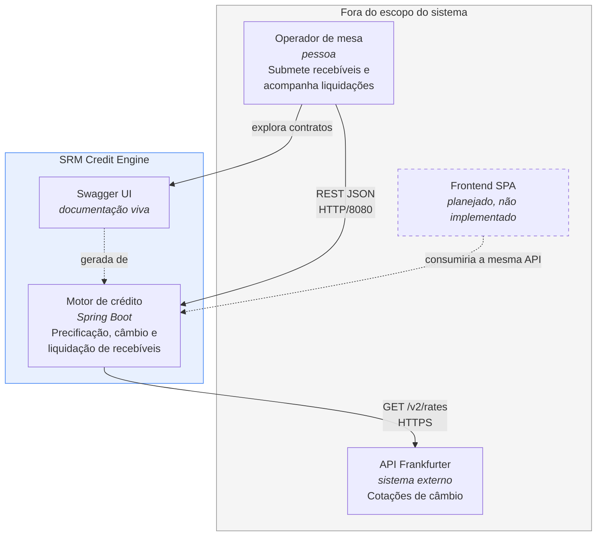
```mermaid
flowchart TB
    subgraph externo["Fora do escopo do sistema"]
        OP["Operador de mesa<br/><i>pessoa</i><br/>Submete recebíveis e<br/>acompanha liquidações"]
        FE["Frontend SPA<br/><i>planejado, não implementado</i>"]
        FRK["API Frankfurter<br/><i>sistema externo</i><br/>Cotações de câmbio"]
    end

    subgraph sistema["SRM Credit Engine"]
        API["Motor de crédito<br/><i>Spring Boot</i><br/>Precificação, câmbio e<br/>liquidação de recebíveis"]
        SW["Swagger UI<br/><i>documentação viva</i>"]
    end

    OP -->|"REST JSON<br/>HTTP/8080"| API
    OP -->|"explora contratos"| SW
    FE -.->|"consumiria a mesma API"| API
    API -->|"GET /v2/rates<br/>HTTPS"| FRK
    SW -.->|"gerada de"| API

    style FE stroke-dasharray: 5 5
    style sistema fill:#e8f0fe,stroke:#4285f4
    style externo fill:#f5f5f5,stroke:#999
```

### Leitura do diagrama

- **Operador → API**: única porta de entrada. Sem autenticação: qualquer chamador alcança qualquer operação.
- **Operador → Swagger**: o `/swagger-ui.html` serve de contrato executável durante a integração.
- **Frontend (pontilhado)**: consumiria exatamente a mesma API REST. Está no diagrama para deixar claro que o contrato foi desenhado para ser consumido por uma SPA, não que a SPA exista.
- **API → Frankfurter**: dependência **externa e síncrona**. Se a Frankfurter cair, `POST /cambios/sincronizar` falha. As liquidações continuam funcionando com as cotações já sincronizadas — o desacoplamento é temporal, não estrutural.
- **Swagger ← API**: gerado a partir das anotações, não escrito à mão. Não pode divergir do código.

### Benefícios

- Deixa evidente que a superfície externa é pequena: um ator, uma dependência.
- Explicita a ausência de autenticação — lacuna que fica visível em vez de escondida.
- Separa o que existe do que é intenção.

### Limitações

- Não mostra volume, frequência nem criticidade das integrações.
- Não representa o RabbitMQ, que é interno ao sistema — aparece no [Diagrama 2](#2-c4--container-diagram).

### Possíveis melhorias

- Adicionar o provedor de identidade (IdP) quando a autenticação existir.
- Modelar o sistema originador dos recebíveis, hoje representado pelo operador humano.
- Anotar SLA esperado da Frankfurter e o comportamento em indisponibilidade.

---

## 2. C4 — Container Diagram

### Objetivo

Abrir a caixa preta em unidades executáveis e armazenamentos, mostrando protocolo e responsabilidade de cada um.

### Quando utilizar

Ao planejar deploy, dimensionar infraestrutura ou discutir escala — é o nível que responde "o que sobe onde".

### Explicação

Três contêineres executáveis (aplicação, banco, broker) orquestrados por Docker Compose. A aplicação é **simultaneamente produtora e consumidora** da fila: o mesmo processo publica e consome, o que simplifica o deploy e limita a escala independente.

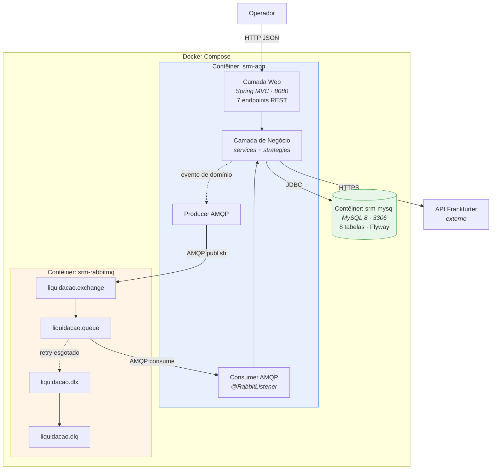
```mermaid
flowchart TB
    OP["Operador"]
    FRK["API Frankfurter<br/><i>externo</i>"]

    subgraph compose["Docker Compose"]
        subgraph app["Contêiner: srm-app"]
            WEB["Camada Web<br/><i>Spring MVC · 8080</i><br/>7 endpoints REST"]
            NEG["Camada de Negócio<br/><i>services + strategies</i>"]
            PROD["Producer AMQP"]
            CONS["Consumer AMQP<br/><i>@RabbitListener</i>"]
        end

        subgraph mq["Contêiner: srm-rabbitmq"]
            EX["liquidacao.exchange"]
            Q["liquidacao.queue"]
            DLX["liquidacao.dlx"]
            DLQ["liquidacao.dlq"]
        end

        DB[("Contêiner: srm-mysql<br/><i>MySQL 8 · 3306</i><br/>8 tabelas · Flyway")]
    end

    OP -->|"HTTP JSON"| WEB
    WEB --> NEG
    NEG -->|"JDBC"| DB
    NEG -->|"HTTPS"| FRK
    NEG -.->|"evento de domínio"| PROD
    PROD -->|"AMQP publish"| EX
    EX --> Q
    Q -->|"AMQP consume"| CONS
    CONS --> NEG
    Q -.->|"retry esgotado"| DLX
    DLX --> DLQ

    style app fill:#e8f0fe,stroke:#4285f4
    style mq fill:#fff4e5,stroke:#f9a825
    style DB fill:#e8f5e9,stroke:#43a047
```

### Leitura do diagrama

- **`srm-app`** contém as quatro responsabilidades no mesmo processo JVM. Producer e Consumer estão no mesmo contêiner: a fila desacopla **no tempo**, não em unidade de deploy.
- **`srm-rabbitmq`** tem quatro objetos: exchange direta, fila durável, DLX e DLQ. A DLQ **não tem consumidor** — é área de parada para inspeção.
- **`srm-mysql`** tem volume persistente (`mysql_data`). O RabbitMQ **não tem volume**: a fila é recriada a cada `docker-compose up`, decisão aceitável em desenvolvimento e inaceitável em produção.
- **Setas pontilhadas** representam caminhos assíncronos ou de exceção.
- **`depends_on: service_healthy`**: a aplicação não sobe antes de o banco aceitar conexão e o broker responder ao ping.

### Benefícios

- Ambiente completo em um comando, com healthcheck e ordem de dependência.
- Separação clara entre estado (MySQL), trânsito (RabbitMQ) e processamento (app).
- A topologia de dead-letter fica visível no nível de infraestrutura, não escondida no código.

### Limitações

- **Producer e Consumer no mesmo processo** impedem escalar API e worker independentemente. Um pico de liquidações consome threads que poderiam atender HTTP.
- Contêiner único da aplicação é ponto único de falha.
- RabbitMQ sem volume perde mensagens em reinício do contêiner.

### Possíveis melhorias

- Perfis Spring `web` e `worker`, permitindo subir o mesmo artefato em dois modos.
- Volume nomeado para o RabbitMQ.
- Healthcheck no serviço `app` (depende do Actuator, hoje ausente).
- Réplica de leitura do MySQL para o extrato.

---

## 3. C4 — Component Diagram

### Objetivo

Detalhar os componentes internos da aplicação e como as dependências fluem entre eles.

### Quando utilizar

Em code review de mudança estrutural, ao decidir onde colocar código novo, e para verificar se a regra de camadas está sendo respeitada.

### Explicação

Componentes agrupados por camada. Duas particularidades merecem aten: o `ExtratoController` **atravessa** a camada de negócio (exceção documentada), e o `LiquidacaoService` **não conhece** o RabbitMQ — publica evento de domínio.

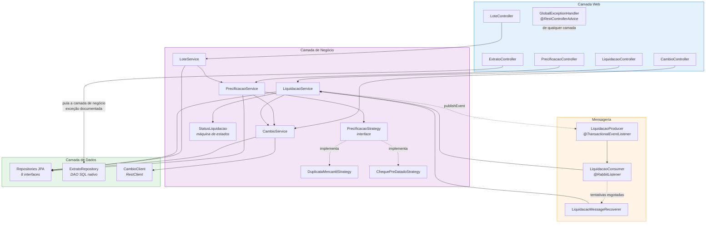
```mermaid
flowchart TB
    subgraph web["Camada Web"]
        C1["PrecificacaoController"]
        C2["CambioController"]
        C3["LoteController"]
        C4["LiquidacaoController"]
        C5["ExtratoController"]
        GEH["GlobalExceptionHandler<br/><i>@RestControllerAdvice</i>"]
    end

    subgraph negocio["Camada de Negócio"]
        S1["PrecificacaoService"]
        ST["PrecificacaoStrategy<br/><i>interface</i>"]
        S1A["DuplicataMercantilStrategy"]
        S1B["ChequePreDatadoStrategy"]
        S2["CambioService"]
        S3["LoteService"]
        S4["LiquidacaoService"]
        SM["StatusLiquidacao<br/><i>máquina de estados</i>"]
    end

    subgraph msg["Mensageria"]
        P["LiquidacaoProducer<br/><i>@TransactionalEventListener</i>"]
        CO["LiquidacaoConsumer<br/><i>@RabbitListener</i>"]
        REC["LiquidacaoMessageRecoverer"]
    end

    subgraph dados["Camada de Dados"]
        R["Repositories JPA<br/><i>8 interfaces</i>"]
        EXT["ExtratoRepository<br/><i>DAO SQL nativo</i>"]
        CLI["CambioClient<br/><i>RestClient</i>"]
    end

    C1 --> S1
    C2 --> S2
    C3 --> S3
    C4 --> S4
    C5 -->|"pula a camada de negócio<br/>exceção documentada"| EXT
    S3 --> S1
    S1 --> ST
    ST -.->|implementa| S1A
    ST -.->|implementa| S1B
    S1 --> S2
    S4 --> S2
    S4 --> SM
    S2 --> CLI
    S1 --> R
    S2 --> R
    S3 --> R
    S4 --> R
    S4 -.->|"publishEvent"| P
    P --> CO
    CO --> S4
    CO -.->|"tentativas esgotadas"| REC
    REC --> S4
    GEH -.->|"traduz exceção<br/>de qualquer camada"| web

    style web fill:#e3f2fd,stroke:#1976d2
    style negocio fill:#f3e5f5,stroke:#7b1fa2
    style msg fill:#fff4e5,stroke:#f9a825
    style dados fill:#e8f5e9,stroke:#43a047
```

### Leitura do diagrama

- **Cinco controllers, um por domínio.** Cada um depende de **interface** de serviço, nunca de implementação.
- **`C5 → EXT`** é a única seta que salta a camada de negócio. Relatório não tem regra de domínio; interpor um service seria repasse vazio.
- **`S1 → ST`** com implementações pontilhadas: o service depende da abstração; adicionar tipo de recebível não toca o service.
- **`S3 → S1`**: o intake de lote reutiliza a precificação. Não há duplicação da fórmula.
- **`S4 -.-> P`**: seta pontilhada porque a comunicação é por **evento**, não chamada direta. Nenhum `RabbitTemplate` dentro de `service/impl`.
- **`CO → S4`**: o consumidor volta ao mesmo service, agora nos métodos de processamento. A lógica de negócio não é duplicada no consumidor.
- **`REC → S4`**: o recoverer marca `FALHA` antes de mandar para a DLQ.
- **`GEH`** é transversal: captura exceção de qualquer camada e traduz em status HTTP.

### Benefícios

- Dependências fluem em uma única direção (web → negócio → dados). Não há ciclo.
- Trocar de broker afeta três classes de `messaging`, nenhuma de negócio.
- A exceção de camada é única, visível e justificada.

### Limitações

- O `LiquidacaoService` acumula cinco responsabilidades (iniciar, processar, finalizar, registrar falha, consultar). É candidato natural a divisão se crescer.
- `CambioService` é dependência de três serviços — mudança nele tem alcance amplo.

### Possíveis melhorias

- Separar `LiquidacaoService` em serviço de comando (iniciar) e de processamento (consumir).
- Introduzir porta/adaptador para o câmbio, isolando a dependência externa atrás de interface própria.

---

## 4. Diagrama de Classes

### Objetivo

Mostrar o modelo de domínio persistente, cardinalidades e a hierarquia do Strategy.

### Quando utilizar

Ao alterar o modelo, escrever query nova, ou entender por que um campo existe.

### Explicação

Oito entidades JPA. A cadeia central é `Recebivel → Precificacao → Liquidacao`, com **duas relações 1:1 protegidas por constraint única**. `Cambio` é referência histórica, nunca alterada após criada.

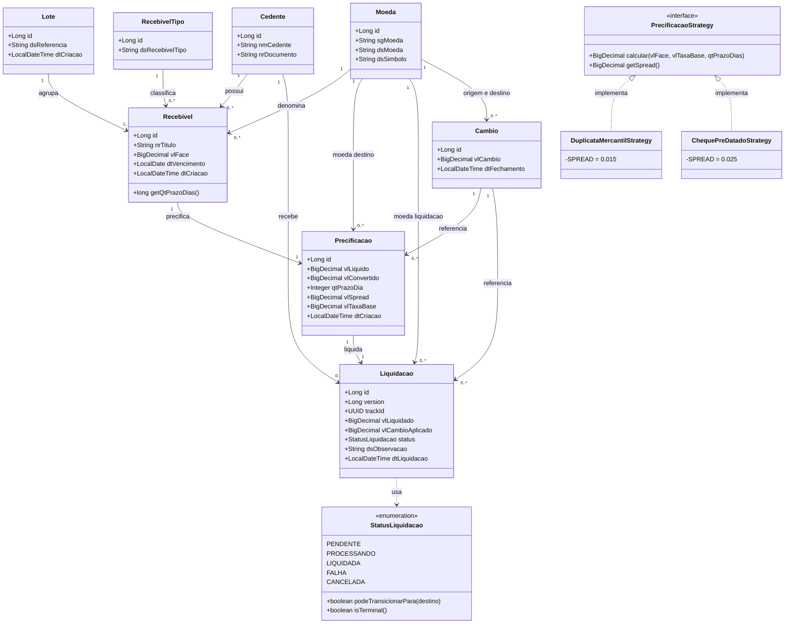
```mermaid
classDiagram
    direction TB

    class Cedente {
        +Long id
        +String nmCedente
        +String nrDocumento
    }

    class Lote {
        +Long id
        +String dsReferencia
        +LocalDateTime dtCriacao
    }

    class RecebivelTipo {
        +Long id
        +String dsRecebivelTipo
    }

    class Moeda {
        +Long id
        +String sgMoeda
        +String dsMoeda
        +String dsSimbolo
    }

    class Recebivel {
        +Long id
        +String nrTitulo
        +BigDecimal vlFace
        +LocalDate dtVencimento
        +LocalDateTime dtCriacao
        +long getQtPrazoDias()
    }

    class Precificacao {
        +Long id
        +BigDecimal vlLiquido
        +BigDecimal vlConvertido
        +Integer qtPrazoDia
        +BigDecimal vlSpread
        +BigDecimal vlTaxaBase
        +LocalDateTime dtCriacao
    }

    class Liquidacao {
        +Long id
        +Long version
        +UUID trackId
        +BigDecimal vlLiquidado
        +BigDecimal vlCambioAplicado
        +StatusLiquidacao status
        +String dsObservacao
        +LocalDateTime dtLiquidacao
    }

    class Cambio {
        +Long id
        +BigDecimal vlCambio
        +LocalDateTime dtFechamento
    }

    class StatusLiquidacao {
        <<enumeration>>
        PENDENTE
        PROCESSANDO
        LIQUIDADA
        FALHA
        CANCELADA
        +boolean podeTransicionarPara(destino)
        +boolean isTerminal()
    }

    class PrecificacaoStrategy {
        <<interface>>
        +BigDecimal calcular(vlFace, vlTaxaBase, qtPrazoDias)
        +BigDecimal getSpread()
    }

    class DuplicataMercantilStrategy {
        -SPREAD = 0.015
    }

    class ChequePreDatadoStrategy {
        -SPREAD = 0.025
    }

    Cedente "1" --> "0..*" Recebivel : possui
    Lote "1" --> "1..*" Recebivel : agrupa
    RecebivelTipo "1" --> "0..*" Recebivel : classifica
    Moeda "1" --> "0..*" Recebivel : denomina
    Recebivel "1" --> "1" Precificacao : precifica
    Precificacao "1" --> "1" Liquidacao : liquida
    Moeda "1" --> "0..*" Precificacao : moeda destino
    Moeda "1" --> "0..*" Liquidacao : moeda liquidacao
    Cedente "1" --> "0..*" Liquidacao : recebe
    Cambio "1" --> "0..*" Precificacao : referencia
    Cambio "1" --> "0..*" Liquidacao : referencia
    Moeda "1" --> "0..*" Cambio : origem e destino
    Liquidacao ..> StatusLiquidacao : usa
    PrecificacaoStrategy <|.. DuplicataMercantilStrategy : implementa
    PrecificacaoStrategy <|.. ChequePreDatadoStrategy : implementa
```

### Leitura do diagrama

- **`Recebivel 1 → 1 Precificacao`**: cada título é precificado uma vez. Não há histórico de reprecificação — a decisão é que uma nova precificação seria um novo recebível.
- **`Precificacao 1 → 1 Liquidacao`**: garantido por `UNIQUE (precificacao_id)`. É a proteção contra pagar duas vezes pelo mesmo título.
- **`version` só em `Liquidacao`**: única entidade com concorrência real de atualização. Aplicar `@Version` em tabela de referência seria custo sem benefício.
- **`trackId` como `UUID`**: chave de idempotência, com constraint única.
- **`vlSpread` e `vlTaxaBase` em `Precificacao`**: são *snapshot*, não referência. Mudança futura de política não reescreve cálculo passado.
- **`getQtPrazoDias()`** é método derivado, não coluna: calcula `dtCriacao → dtVencimento`.
- **`StatusLiquidacao`** não é enum burro: carrega a tabela de transições.
- **Strategy**: sem herança de classe, apenas implementação de interface. Cada strategy encapsula sua constante `SPREAD`.

### Benefícios

- Cadeia de rastreabilidade completa: da liquidação chega-se ao título, ao cedente e ao lote.
- Snapshot histórico torna a auditoria possível anos depois.
- Concorrência controlada onde importa, sem custo onde não importa.

### Limitações

- `Precificacao.cambio` existe mas fica **sempre nulo** — `CambioService.converter` devolve só um `BigDecimal`, sem a referência à cotação. Rastreabilidade incompleta.
- Sem herança no modelo: se surgirem tipos de recebível com atributos próprios, será necessário decidir entre tabela única, `@Inheritance` ou tabelas separadas.
- `Lote` tem apenas referência descritiva; não guarda a taxa base usada (ela vive replicada em cada `Precificacao`).

### Possíveis melhorias

- Popular `Precificacao.cambio`, alterando `converter` para devolver a cotação usada.
- Avaliar `@Embeddable` para o trio spread/taxa/prazo, deixando explícito que é um snapshot coeso.
- Adicionar `dt_atualizacao` nas entidades que hoje só têm `dt_criacao`.

---

## 5. Diagrama ER

### Objetivo

Representar o schema físico com chaves, tipos, constraints e índices.

### Quando utilizar

Ao escrever query, planejar migration, ou investigar problema de performance.

### Explicação

Oito tabelas em MySQL 8 / InnoDB, versionadas por Flyway com `ddl-auto=validate`. Os tipos monetários são `DECIMAL` exato; as constraints codificam regra de negócio no banco, não apenas no código.

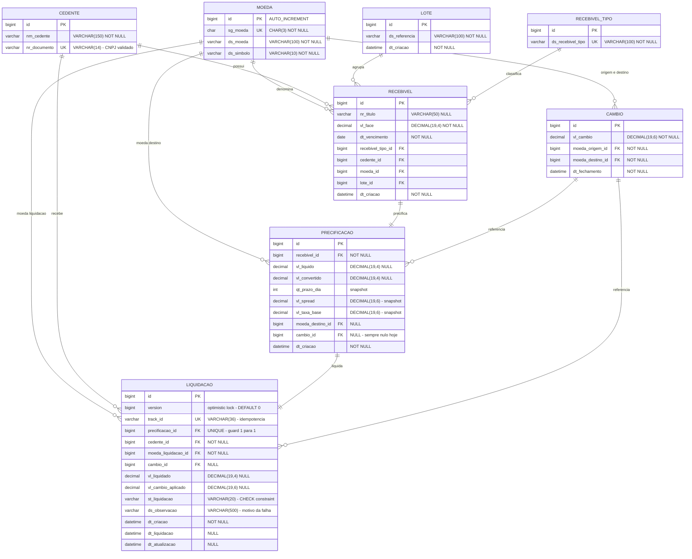
```mermaid
erDiagram
    MOEDA ||--o{ RECEBIVEL : denomina
    MOEDA ||--o{ CAMBIO : "origem e destino"
    MOEDA ||--o{ PRECIFICACAO : "moeda destino"
    MOEDA ||--o{ LIQUIDACAO : "moeda liquidacao"
    CEDENTE ||--o{ RECEBIVEL : possui
    CEDENTE ||--o{ LIQUIDACAO : recebe
    LOTE ||--o{ RECEBIVEL : agrupa
    RECEBIVEL_TIPO ||--o{ RECEBIVEL : classifica
    RECEBIVEL ||--|| PRECIFICACAO : precifica
    PRECIFICACAO ||--|| LIQUIDACAO : liquida
    CAMBIO ||--o{ PRECIFICACAO : referencia
    CAMBIO ||--o{ LIQUIDACAO : referencia

    MOEDA {
        bigint id PK "AUTO_INCREMENT"
        char sg_moeda UK "CHAR(3) NOT NULL"
        varchar ds_moeda "VARCHAR(100) NOT NULL"
        varchar ds_simbolo "VARCHAR(10) NOT NULL"
    }
    CEDENTE {
        bigint id PK
        varchar nm_cedente "VARCHAR(150) NOT NULL"
        varchar nr_documento UK "VARCHAR(14) - CNPJ validado"
    }
    LOTE {
        bigint id PK
        varchar ds_referencia "VARCHAR(100) NOT NULL"
        datetime dt_criacao "NOT NULL"
    }
    RECEBIVEL_TIPO {
        bigint id PK
        varchar ds_recebivel_tipo UK "VARCHAR(100) NOT NULL"
    }
    CAMBIO {
        bigint id PK
        decimal vl_cambio "DECIMAL(19,6) NOT NULL"
        bigint moeda_origem_id FK "NOT NULL"
        bigint moeda_destino_id FK "NOT NULL"
        datetime dt_fechamento "NOT NULL"
    }
    RECEBIVEL {
        bigint id PK
        varchar nr_titulo "VARCHAR(50) NULL"
        decimal vl_face "DECIMAL(19,4) NOT NULL"
        date dt_vencimento "NOT NULL"
        bigint recebivel_tipo_id FK
        bigint cedente_id FK
        bigint moeda_id FK
        bigint lote_id FK
        datetime dt_criacao "NOT NULL"
    }
    PRECIFICACAO {
        bigint id PK
        bigint recebivel_id FK "NOT NULL"
        decimal vl_liquido "DECIMAL(19,4) NULL"
        decimal vl_convertido "DECIMAL(19,4) NULL"
        int qt_prazo_dia "snapshot"
        decimal vl_spread "DECIMAL(19,6) - snapshot"
        decimal vl_taxa_base "DECIMAL(19,6) - snapshot"
        bigint moeda_destino_id FK "NULL"
        bigint cambio_id FK "NULL - sempre nulo hoje"
        datetime dt_criacao "NOT NULL"
    }
    LIQUIDACAO {
        bigint id PK
        bigint version "optimistic lock - DEFAULT 0"
        varchar track_id UK "VARCHAR(36) - idempotencia"
        bigint precificacao_id FK "UNIQUE - guard 1 para 1"
        bigint cedente_id FK "NOT NULL"
        bigint moeda_liquidacao_id FK "NOT NULL"
        bigint cambio_id FK "NULL"
        decimal vl_liquidado "DECIMAL(19,4) NULL"
        decimal vl_cambio_aplicado "DECIMAL(19,6) NULL"
        varchar st_liquidacao "VARCHAR(20) - CHECK constraint"
        varchar ds_observacao "VARCHAR(500) - motivo da falha"
        datetime dt_criacao "NOT NULL"
        datetime dt_liquidacao "NULL"
        datetime dt_atualizacao "NULL"
    }
```

### Leitura do diagrama e da modelagem

**Tipos monetários.** `DECIMAL(19,4)` para valores, `DECIMAL(19,6)` para taxas. Taxa precisa de mais casas porque é composta — erro de arredondamento acumularia na exponenciação. Nunca `FLOAT`/`DOUBLE`.

**Constraints que codificam regra de negócio:**

| Constraint | Regra que protege |
|---|---|
| `UNIQUE (track_id)` | Idempotência: mesma chave nunca cria duas liquidações |
| `UNIQUE (precificacao_id)` | Um título liquida uma vez |
| `UNIQUE (moeda_origem_id, moeda_destino_id, dt_fechamento)` | Cotação não duplica (migration `V3`) |
| `CHECK (st_liquidacao IN (...))` | Estado inválido não entra, nem por acesso direto ao banco |
| `version DEFAULT 0` | Base do optimistic lock |

**Índices, e por que existem:**

| Índice | Consulta que atende |
|---|---|
| `(cedente_id, dt_liquidacao)` | Filtro mais frequente do extrato — cedente + período |
| `(moeda_origem_id, moeda_destino_id, dt_fechamento DESC)` | `buscarUltimoCambio` — o `DESC` evita ordenação em disco |
| `st_liquidacao` | Extrato filtra `= 'LIQUIDADA'` |
| `dt_vencimento` (recebivel) | Consultas por janela de vencimento |
| FKs individuais | Junções do extrato |

**Migrations:** `V1` cria o schema, `V2` insere dados de referência (BRL, USD, dois tipos de recebível), `V3` deduplica e adiciona a constraint de câmbio. Migration aplicada nunca é editada.

### Benefícios

- Integridade garantida no banco, independente do código da aplicação.
- `ddl-auto=validate`: divergência entre entidade e schema impede a aplicação de subir.
- Índices derivados de consultas reais, não especulativos.

### Limitações

- `cambio_id` em `precificacao` e `liquidacao` está sempre nulo — coluna sem uso.
- Sem particionamento: `liquidacao` cresce indefinidamente.
- `ds_observacao` com 500 caracteres pode truncar mensagem longa (o código trunca explicitamente).

### Possíveis melhorias

- Popular `cambio_id` para rastreabilidade completa da cotação aplicada.
- Particionar `liquidacao` por `dt_liquidacao` quando o volume justificar.
- Tabela `outbox` para eliminar o *dual-write* do publish.

---

## 6. Sequência — Intake de Recebível

### Objetivo

Detalhar o fluxo transacional que transforma um payload de lote em recebíveis e precificações persistidas.

### Quando utilizar

Ao investigar por que um lote falhou, ou ao entender o escopo da transação.

### Explicação

> **Divergência:** o prompt pede "cadastro de recebível" como fluxo isolado. **Não existe endpoint de recebível.** Recebíveis nascem dentro de `POST /lotes`, numa transação única — o que é uma decisão de negócio: recebível órfão, sem lote e sem precificação, não tem significado no domínio.

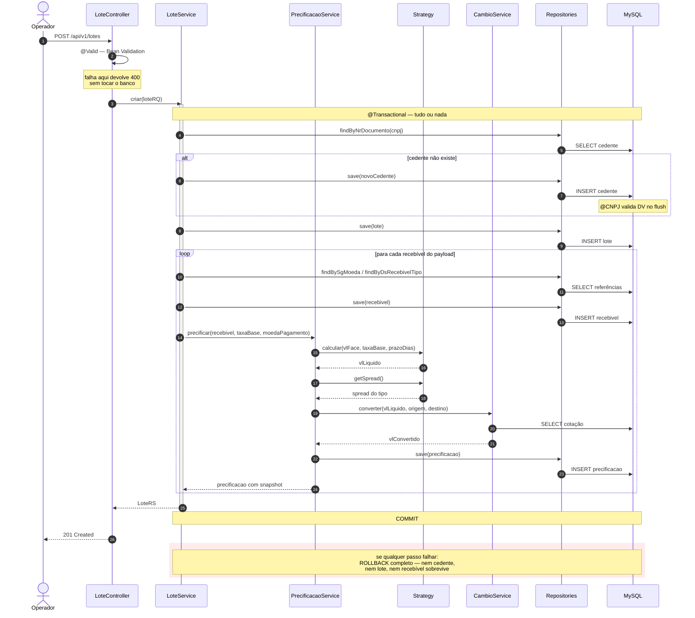
```mermaid
sequenceDiagram
    autonumber
    actor OP as Operador
    participant CT as LoteController
    participant SV as LoteService
    participant PS as PrecificacaoService
    participant ST as Strategy
    participant CS as CambioService
    participant RP as Repositories
    participant DB as MySQL

    OP->>CT: POST /api/v1/lotes
    CT->>CT: @Valid — Bean Validation
    Note over CT: falha aqui devolve 400<br/>sem tocar o banco

    CT->>SV: criar(loteRQ)
    activate SV
    Note over SV,DB: @Transactional — tudo ou nada

    SV->>RP: findByNrDocumento(cnpj)
    RP->>DB: SELECT cedente
    alt cedente não existe
        SV->>RP: save(novoCedente)
        RP->>DB: INSERT cedente
        Note over DB: @CNPJ valida DV no flush
    end

    SV->>RP: save(lote)
    RP->>DB: INSERT lote

    loop para cada recebível do payload
        SV->>RP: findBySgMoeda / findByDsRecebivelTipo
        RP->>DB: SELECT referências
        SV->>RP: save(recebivel)
        RP->>DB: INSERT recebivel
        SV->>PS: precificar(recebivel, taxaBase, moedaPagamento)
        PS->>ST: calcular(vlFace, taxaBase, prazoDias)
        ST-->>PS: vlLiquido
        PS->>ST: getSpread()
        ST-->>PS: spread do tipo
        PS->>CS: converter(vlLiquido, origem, destino)
        CS->>DB: SELECT cotação
        CS-->>PS: vlConvertido
        PS->>RP: save(precificacao)
        RP->>DB: INSERT precificacao
        PS-->>SV: precificacao com snapshot
    end

    SV-->>CT: LoteRS
    deactivate SV
    Note over SV,DB: COMMIT
    CT-->>OP: 201 Created

    rect rgb(255, 235, 235)
        Note over SV,DB: se qualquer passo falhar:<br/>ROLLBACK completo — nem cedente,<br/>nem lote, nem recebível sobrevive
    end
```

### Leitura do diagrama

1. **Validação antes da transação (passos 2-3)**: Bean Validation roda no controller. Payload inválido nunca abre transação.
2. **Resolução de cedente por documento (5-8)**: idempotente por CNPJ. Reenviar o mesmo lote não duplica cedente — mas **também não atualiza o nome**, comportamento deliberado.
3. **Loop por recebível (12-24)**: cada item resolve referências, persiste, e precifica.
4. **`getSpread()` (17-18)**: chamada separada do cálculo. É o que permite congelar o spread no snapshot.
5. **Conversão cambial dentro do loop (19-21)**: consulta ao banco por item. Ponto de otimização — a cotação do dia é imutável e cacheável.
6. **COMMIT único (27)**: tudo ou nada. Verificado por teste de integração que compara contagens antes e depois de uma falha.

### Benefícios

- Atomicidade real: lote parcialmente gravado é impossível.
- Reuso da precificação: o intake não duplica a fórmula.
- Snapshot congelado no mesmo momento da criação — consistência temporal garantida.

### Limitações

- **Transação longa** proporcional ao número de recebíveis. Lote de 10.000 itens mantém locks abertos por muito tempo.
- Consulta de cotação repetida por item.
- Sem processamento em lote (`batch insert`): um `INSERT` por recebível.

### Possíveis melhorias

- `hibernate.jdbc.batch_size` para agrupar inserts.
- Cache de cotação por transação.
- Para lotes muito grandes, quebrar em chunks com transação por chunk — abandonando a atomicidade total em troca de escala, decisão que precisa de aval de negócio.

---

## 7. Sequência — Simulação de Precificação

### Objetivo

Mostrar o caminho mais curto do sistema: cálculo sem persistência.

### Quando utilizar

Ao entender o cálculo isoladamente, ou ao demonstrar o produto — é o endpoint que responde em milissegundos sem efeito colateral.

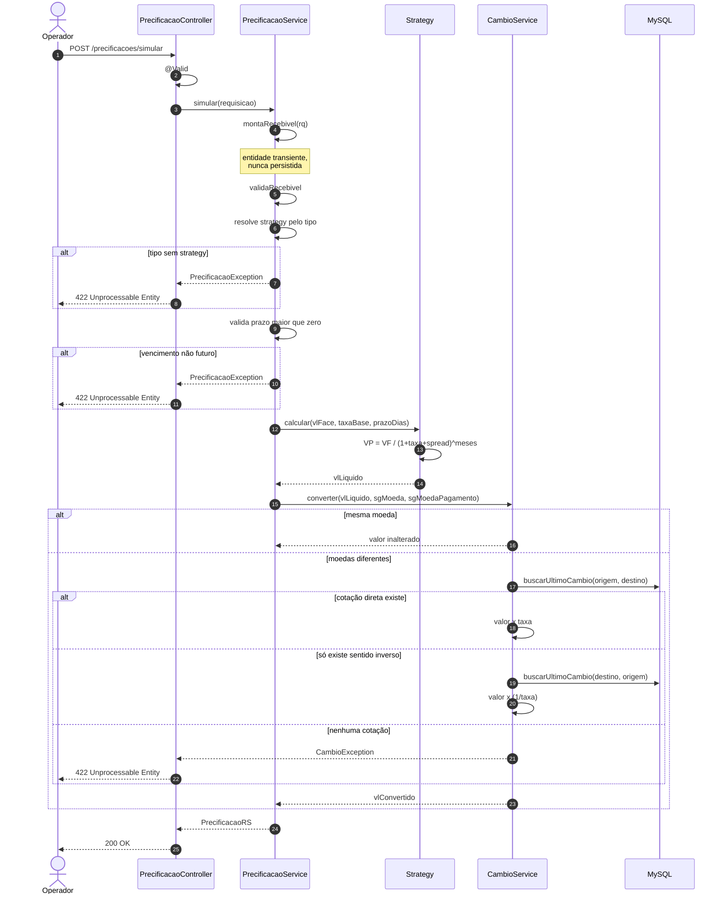
```mermaid
sequenceDiagram
    autonumber
    actor OP as Operador
    participant CT as PrecificacaoController
    participant PS as PrecificacaoService
    participant ST as Strategy
    participant CS as CambioService
    participant DB as MySQL

    OP->>CT: POST /precificacoes/simular
    CT->>CT: @Valid
    CT->>PS: simular(requisicao)

    PS->>PS: montaRecebivel(rq)
    Note over PS: entidade transiente,<br/>nunca persistida

    PS->>PS: validaRecebivel
    PS->>PS: resolve strategy pelo tipo
    alt tipo sem strategy
        PS-->>CT: PrecificacaoException
        CT-->>OP: 422 Unprocessable Entity
    end
    PS->>PS: valida prazo maior que zero
    alt vencimento não futuro
        PS-->>CT: PrecificacaoException
        CT-->>OP: 422 Unprocessable Entity
    end

    PS->>ST: calcular(vlFace, taxaBase, prazoDias)
    ST->>ST: VP = VF / (1+taxa+spread)^meses
    ST-->>PS: vlLiquido

    PS->>CS: converter(vlLiquido, sgMoeda, sgMoedaPagamento)
    alt mesma moeda
        CS-->>PS: valor inalterado
    else moedas diferentes
        CS->>DB: buscarUltimoCambio(origem, destino)
        alt cotação direta existe
            CS->>CS: valor x taxa
        else só existe sentido inverso
            CS->>DB: buscarUltimoCambio(destino, origem)
            CS->>CS: valor x (1/taxa)
        else nenhuma cotação
            CS-->>CT: CambioException
            CT-->>OP: 422 Unprocessable Entity
        end
        CS-->>PS: vlConvertido
    end

    PS-->>CT: PrecificacaoRS
    CT-->>OP: 200 OK
```

### Leitura do diagrama

- **Entidade transiente (passos 4-5)**: o `Recebivel` é montado em memória apenas para reaproveitar a validação e o cálculo. Nunca chega ao banco — daí a moeda ficar nula, e daí a validação de moeda existir só em `precificar`, não em `calcular`.
- **Três portas de saída 422**: tipo sem strategy, prazo inválido, cotação inexistente. Todas são regra de negócio, não erro técnico.
- **Fórmula na strategy (18-20)**: `VP = VF / (1 + taxa + spread)^meses`, com prazo em meses (dias ÷ 30).
- **Taxa inversa (27-30)**: se existe `BRL→USD` mas não `USD→BRL`, o sistema calcula `1/taxa` com 10 casas antes de arredondar em 4. Evita perder precisão na inversão.
- **Sem transação de escrita**: o método não é `@Transactional` de escrita; só há leitura de cotação.

### Benefícios

- Resposta rápida, sem efeito colateral — seguro para o operador explorar cenários.
- Reutiliza exatamente o mesmo código de cálculo do fluxo persistido: simulação e execução nunca divergem.
- Taxa inversa evita exigir sincronização nos dois sentidos.

### Limitações

- Simulação não é registrada: não há histórico do que o operador consultou antes de decidir.
- Depende de cotação previamente sincronizada — não busca na Frankfurter sob demanda.

### Possíveis melhorias

- Registrar simulações para auditoria comercial (o que foi cotado e não fechou).
- Endpoint de simulação em lote, para comparar cenários de uma vez.

---

## 8. Sequência — Liquidação Assíncrona

### Objetivo

Detalhar o fluxo mais crítico do sistema, incluindo o corte entre síncrono e assíncrono.

### Quando utilizar

Ao investigar liquidação travada, entender o `202`, ou explicar por que o resultado não vem na resposta.

### Explicação

O fluxo é **partido em duas metades** por uma fila. A requisição HTTP valida, persiste `PENDENTE` e responde. Câmbio e baixa acontecem depois, no consumidor.

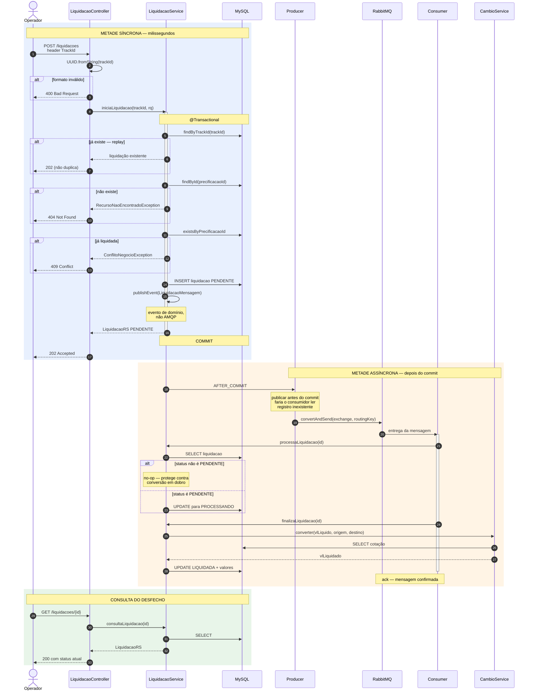
```mermaid
sequenceDiagram
    autonumber
    actor OP as Operador
    participant CT as LiquidacaoController
    participant SV as LiquidacaoService
    participant DB as MySQL
    participant PR as Producer
    participant MQ as RabbitMQ
    participant CO as Consumer
    participant CS as CambioService

    rect rgb(232, 240, 254)
        Note over OP,DB: METADE SÍNCRONA — milissegundos
        OP->>CT: POST /liquidacoes<br/>header TrackId
        CT->>CT: UUID.fromString(trackId)
        alt formato inválido
            CT-->>OP: 400 Bad Request
        end
        CT->>SV: iniciaLiquidacao(trackId, rq)
        activate SV
        Note over SV,DB: @Transactional

        SV->>DB: findByTrackId(trackId)
        alt já existe — replay
            SV-->>CT: liquidação existente
            CT-->>OP: 202 (não duplica)
        end

        SV->>DB: findById(precificacaoId)
        alt não existe
            SV-->>CT: RecursoNaoEncontradoException
            CT-->>OP: 404 Not Found
        end

        SV->>DB: existsByPrecificacaoId
        alt já liquidada
            SV-->>CT: ConflitoNegocioException
            CT-->>OP: 409 Conflict
        end

        SV->>DB: INSERT liquidacao PENDENTE
        SV->>SV: publishEvent(LiquidacaoMensagem)
        Note over SV: evento de domínio,<br/>não AMQP
        SV-->>CT: LiquidacaoRS PENDENTE
        deactivate SV
        Note over SV,DB: COMMIT
        CT-->>OP: 202 Accepted
    end

    rect rgb(255, 244, 229)
        Note over PR,CS: METADE ASSÍNCRONA — depois do commit
        SV->>PR: AFTER_COMMIT
        Note over PR: publicar antes do commit<br/>faria o consumidor ler<br/>registro inexistente
        PR->>MQ: convertAndSend(exchange, routingKey)
        MQ->>CO: entrega da mensagem
        activate CO

        CO->>SV: processaLiquidacao(id)
        SV->>DB: SELECT liquidacao
        alt status não é PENDENTE
            Note over SV: no-op — protege contra<br/>conversão em dobro
        else status é PENDENTE
            SV->>DB: UPDATE para PROCESSANDO
        end

        CO->>SV: finalizaLiquidacao(id)
        SV->>CS: converter(vlLiquido, origem, destino)
        CS->>DB: SELECT cotação
        CS-->>SV: vlLiquidado
        SV->>DB: UPDATE LIQUIDADA + valores
        deactivate CO
        Note over CO,MQ: ack — mensagem confirmada
    end

    rect rgb(232, 245, 233)
        Note over OP,DB: CONSULTA DO DESFECHO
        OP->>CT: GET /liquidacoes/{id}
        CT->>SV: consultaLiquidacao(id)
        SV->>DB: SELECT
        SV-->>CT: LiquidacaoRS
        CT-->>OP: 200 com status atual
    end
```

### Leitura do diagrama

**Metade síncrona (1-25).** Quatro portas de saída antes de persistir: 400 (UUID inválido), replay (202 sem duplicar), 404 (precificação inexistente), 409 (já liquidada). A ordem importa: o replay é verificado **primeiro**, porque reenvio é caso esperado, não erro.

**`publishEvent` (22-23) não é AMQP.** É evento de domínio do Spring. O service não conhece RabbitMQ — essa é a fronteira do Observer.

**`AFTER_COMMIT` (28-30)** é o detalhe mais importante do diagrama. Publicar dentro da transação criaria janela em que o consumidor lê um registro que ainda não existe, ou que sofreu rollback.

**Guard de idempotência (35-40).** `processaLiquidacao` só avança quem está `PENDENTE`. Mensagem duplicada em `PROCESSANDO` é no-op. O guard ingênuo (`if status == LIQUIDADA`) permitia reentrada e **conversão de câmbio em dobro** — bug real, corrigido e coberto por teste.

**Consulta separada (48-53).** Contrapartida obrigatória do `202`: sem ela, o cliente recebe um id e não descobre o desfecho.

### Benefícios

- Requisição HTTP não fica presa em I/O externo.
- Pico de carga é absorvido pela fila, não pelo banco.
- Três camadas de proteção contra duplicidade: replay, guard em código, constraints no banco.

### Limitações

- **`202` não informa resultado.** Exige polling — o cliente precisa consultar.
- **Dual-write**: o publish roda fora da transação. RabbitMQ indisponível no instante do `convertAndSend` deixa a liquidação órfã em `PENDENTE`.
- Erro de negócio no processamento não pode mais virar `422` — vira `FALHA` consultável.

### Possíveis melhorias

- **Outbox pattern**: gravar o evento em tabela na mesma transação, com publisher varrendo-a. Elimina o dual-write.
- Webhook ou SSE para notificar o desfecho, eliminando polling.
- Job de varredura de `PENDENTE` antigo, como mitigação de curto prazo do dual-write.

---

## 9. Sequência — Conversão Cambial

### Objetivo

Detalhar a lógica de conversão, incluindo taxa inversa e o upsert de sincronização.

### Quando utilizar

Ao investigar valor convertido inesperado, ou ao adicionar par de moedas.

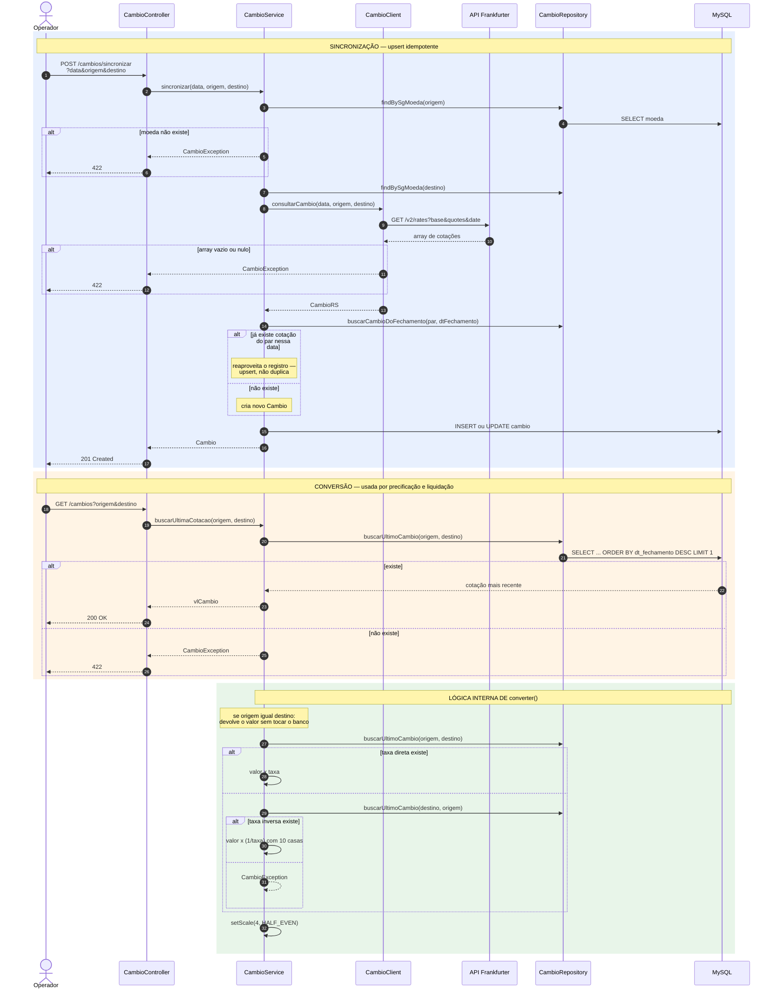
```mermaid
sequenceDiagram
    autonumber
    actor OP as Operador
    participant CT as CambioController
    participant CS as CambioService
    participant CL as CambioClient
    participant FRK as API Frankfurter
    participant RP as CambioRepository
    participant DB as MySQL

    rect rgb(232, 240, 254)
        Note over OP,DB: SINCRONIZAÇÃO — upsert idempotente
        OP->>CT: POST /cambios/sincronizar<br/>?data&origem&destino
        CT->>CS: sincronizar(data, origem, destino)
        CS->>RP: findBySgMoeda(origem)
        RP->>DB: SELECT moeda
        alt moeda não existe
            CS-->>CT: CambioException
            CT-->>OP: 422
        end
        CS->>RP: findBySgMoeda(destino)
        CS->>CL: consultarCambio(data, origem, destino)
        CL->>FRK: GET /v2/rates?base&quotes&date
        FRK-->>CL: array de cotações
        alt array vazio ou nulo
            CL-->>CT: CambioException
            CT-->>OP: 422
        end
        CL-->>CS: CambioRS

        CS->>RP: buscarCambioDoFechamento(par, dtFechamento)
        alt já existe cotação do par nessa data
            Note over CS: reaproveita o registro —<br/>upsert, não duplica
        else não existe
            Note over CS: cria novo Cambio
        end
        CS->>DB: INSERT ou UPDATE cambio
        CS-->>CT: Cambio
        CT-->>OP: 201 Created
    end

    rect rgb(255, 244, 229)
        Note over OP,DB: CONVERSÃO — usada por precificação e liquidação
        OP->>CT: GET /cambios?origem&destino
        CT->>CS: buscarUltimaCotacao(origem, destino)
        CS->>RP: buscarUltimoCambio(origem, destino)
        RP->>DB: SELECT ... ORDER BY dt_fechamento DESC LIMIT 1
        alt existe
            DB-->>CS: cotação mais recente
            CS-->>CT: vlCambio
            CT-->>OP: 200 OK
        else não existe
            CS-->>CT: CambioException
            CT-->>OP: 422
        end
    end

    rect rgb(232, 245, 233)
        Note over CS,DB: LÓGICA INTERNA DE converter()
        Note over CS: se origem igual destino:<br/>devolve o valor sem tocar o banco
        CS->>RP: buscarUltimoCambio(origem, destino)
        alt taxa direta existe
            CS->>CS: valor x taxa
        else
            CS->>RP: buscarUltimoCambio(destino, origem)
            alt taxa inversa existe
                CS->>CS: valor x (1/taxa) com 10 casas
            else
                CS-->>CS: CambioException
            end
        end
        CS->>CS: setScale(4, HALF_EVEN)
    end
```

### Leitura do diagrama

- **Validação de moeda antes da chamada externa (4-9)**: não gasta requisição HTTP se a moeda não existe no cadastro.
- **A data usada é a devolvida pela API (14-16)**, não a solicitada. Fim de semana ou feriado devolve a última cotação disponível — e o sistema grava com a data real da cotação.
- **Upsert (19-25)**: busca por par + data antes de inserir. Sem isso, sincronizar duas vezes criava duplicatas — e a consulta com `Optional` passava a lançar `NonUniqueResultException`, derrubando todo o cross-currency. Bug real, corrigido em três frentes: `LIMIT 1` na query, upsert no service, e `UNIQUE` na migration `V3`.
- **`LIMIT 1` (32)**: extensão HQL do Hibernate. Torna o `Optional` honesto — no máximo uma linha por construção.
- **Curto-circuito de mesma moeda (45)**: não toca o banco quando origem e destino são iguais.
- **Taxa inversa com 10 casas (51)**: a divisão usa precisão maior que o resultado final para não perder exatidão antes do arredondamento.

### Benefícios

- Sincronização idempotente: reexecução não corrompe dados.
- Taxa inversa dispensa sincronizar os dois sentidos de cada par.
- Falha na API externa não é `ErroDeNegocio`, então o consumidor a trata como transitória e retenta.

### Limitações

- Cotação é consultada a cada conversão — query redundante, já que a cotação do dia é imutável.
- Sem timeout explícito no `RestClient`: chamada à Frankfurter pode prender a thread.
- Sem circuit breaker: indisponibilidade externa consome tentativas de retry.

### Possíveis melhorias

- `@Cacheable` com TTL curto na cotação.
- Timeout de connect/read e circuit breaker (Resilience4j).
- Job agendado sincronizando os pares ativos, em vez de depender de chamada manual.

---

## 10. Fluxo completo do sistema

### Objetivo

Visão única do caminho do dado, do payload de entrada ao extrato.

### Quando utilizar

Em onboarding, ou para localizar em que etapa um problema aconteceu.

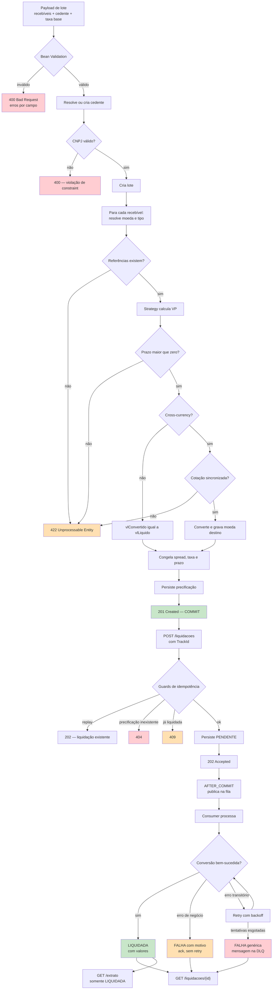
```mermaid
flowchart TB
    A["Payload de lote<br/>recebíveis + cedente + taxa base"] --> B{"Bean Validation"}
    B -->|inválido| B1["400 Bad Request<br/>erros por campo"]
    B -->|válido| C["Resolve ou cria cedente"]
    C --> D{"CNPJ válido?"}
    D -->|não| D1["400 — violação de constraint"]
    D -->|sim| E["Cria lote"]
    E --> F["Para cada recebível:<br/>resolve moeda e tipo"]
    F --> G{"Referências existem?"}
    G -->|não| G1["422 Unprocessable Entity"]
    G -->|sim| H["Strategy calcula VP"]
    H --> I{"Prazo maior que zero?"}
    I -->|não| G1
    I -->|sim| J{"Cross-currency?"}
    J -->|não| L["vlConvertido igual a vlLiquido"]
    J -->|sim| K{"Cotação sincronizada?"}
    K -->|não| G1
    K -->|sim| K1["Converte e grava moeda destino"]
    L --> M["Congela spread, taxa e prazo"]
    K1 --> M
    M --> N["Persiste precificação"]
    N --> O["201 Created — COMMIT"]

    O --> P["POST /liquidacoes<br/>com TrackId"]
    P --> Q{"Guards de idempotência"}
    Q -->|replay| Q1["202 — liquidação existente"]
    Q -->|precificação inexistente| Q2["404"]
    Q -->|já liquidada| Q3["409"]
    Q -->|ok| R["Persiste PENDENTE"]
    R --> S["202 Accepted"]
    S --> T["AFTER_COMMIT<br/>publica na fila"]
    T --> U["Consumer processa"]
    U --> V{"Conversão bem-sucedida?"}
    V -->|sim| W["LIQUIDADA<br/>com valores"]
    V -->|erro de negócio| X["FALHA com motivo<br/>ack, sem retry"]
    V -->|erro transitório| Y["Retry com backoff"]
    Y --> V
    Y -->|tentativas esgotadas| Z["FALHA genérica<br/>mensagem na DLQ"]
    W --> AA["GET /liquidacoes/{id}"]
    X --> AA
    Z --> AA
    W --> AB["GET /extrato<br/>somente LIQUIDADA"]

    style B1 fill:#ffcdd2
    style D1 fill:#ffcdd2
    style G1 fill:#ffe0b2
    style Q2 fill:#ffcdd2
    style Q3 fill:#ffe0b2
    style O fill:#c8e6c9
    style W fill:#c8e6c9
    style X fill:#ffe0b2
    style Z fill:#ffcdd2
```

### Leitura do diagrama

- **Duas fases distintas**: intake (A→O, síncrono e transacional) e liquidação (P→AA, com corte assíncrono).
- **Cores comunicam severidade**: vermelho é erro do cliente ou falha definitiva; laranja é regra de negócio; verde é sucesso.
- **`G1` recebe três setas**: tipo/moeda inexistente, prazo inválido e cotação ausente convergem no mesmo 422. São naturezas diferentes com o mesmo tratamento — todas exigem intervenção humana.
- **O laço `Y → V`** é o retry com backoff. Sai por sucesso ou por esgotamento.
- **`X` e `Z` chegam ao mesmo `AA`**: falha de negócio e falha esgotada são ambas consultáveis, com granularidade diferente de mensagem.
- **Só `W` alimenta o extrato**: o relatório é de dinheiro efetivamente liquidado.

### Benefícios

- Mostra em um único lugar todos os pontos de decisão e todas as saídas de erro.
- Torna evidente qual status HTTP corresponde a qual falha.
- Explicita que o extrato tem escopo restrito.

### Limitações

- Não representa tempo nem concorrência.
- Omite o caminho `CANCELADA`, que existe na máquina de estados mas não tem endpoint.

### Possíveis melhorias

- Anotar latência típica de cada etapa após medição.
- Incluir o caminho de cancelamento quando o endpoint existir.

---

## 11. Processamento Assíncrono

### Objetivo

Detalhar a topologia AMQP e a política de retry e dead-lettering.

### Quando utilizar

Ao investigar mensagem na DLQ, ajustar retry, ou entender por que uma liquidação não avançou.

### Explicação

A decisão central é **classificar a falha antes de decidir se vale retentar**. Erro determinístico não deve consumir tentativas.

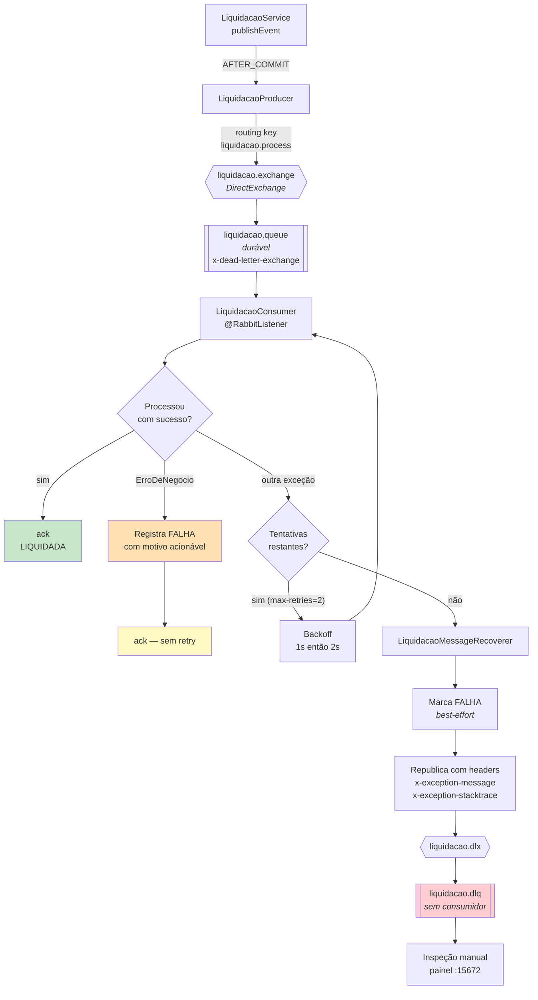
```mermaid
flowchart TB
    SV["LiquidacaoService<br/>publishEvent"] -->|AFTER_COMMIT| PR["LiquidacaoProducer"]
    PR -->|"routing key<br/>liquidacao.process"| EX{{"liquidacao.exchange<br/><i>DirectExchange</i>"}}
    EX --> Q[["liquidacao.queue<br/><i>durável</i><br/>x-dead-letter-exchange"]]
    Q --> CO["LiquidacaoConsumer<br/>@RabbitListener"]

    CO --> DEC{"Processou<br/>com sucesso?"}
    DEC -->|sim| ACK["ack<br/>LIQUIDADA"]
    DEC -->|"ErroDeNegocio"| BN["Registra FALHA<br/>com motivo acionável"]
    BN --> ACK2["ack — sem retry"]
    DEC -->|"outra exceção"| RT{"Tentativas<br/>restantes?"}

    RT -->|"sim (max-retries=2)"| BO["Backoff<br/>1s então 2s"]
    BO --> CO
    RT -->|não| REC["LiquidacaoMessageRecoverer"]
    REC --> RF["Marca FALHA<br/><i>best-effort</i>"]
    RF --> RP["Republica com headers<br/>x-exception-message<br/>x-exception-stacktrace"]
    RP --> DLX{{"liquidacao.dlx"}}
    DLX --> DLQ[["liquidacao.dlq<br/><i>sem consumidor</i>"]]
    DLQ --> INS["Inspeção manual<br/>painel :15672"]

    style ACK fill:#c8e6c9
    style ACK2 fill:#fff9c4
    style DLQ fill:#ffcdd2
    style BN fill:#ffe0b2
```

### Leitura do diagrama

**Classificação da falha (`DEC`)** é o nó decisivo:

| Natureza | Ação | Racional |
|---|---|---|
| Sucesso | ack | — |
| `ErroDeNegocio` | registra `FALHA` + ack, **sem retry** | Retentar não muda o resultado. Gastar backoff em erro que só some com intervenção humana é desperdício |
| Qualquer outra | relança → retry → DLQ | Pode ser transitória (banco indisponível, timeout) |

**`max-retries=2` significa 3 execuções.** A propriedade conta **retentativas**, não entregas: uma inicial mais duas.

> **Armadilha de configuração documentada.** No Spring Boot 4, a propriedade é `max-retries`. A antiga `max-attempts` está deprecada em nível `error` e é **ignorada em silêncio** — o sintoma engana, porque `initial-interval` e `multiplier` continuam funcionando, e o backoff parece configurado.

**`default-requeue-rejected=false` é obrigatório.** Sem ele, a mensagem rejeitada volta para a fila original em vez de ir para a DLX — falha permanente vira **loop infinito**.

**`REC → RF` é best-effort.** Se marcar `FALHA` também falhar (caso típico: a liquidação não existe, que é a causa original), o erro é logado e a republicação acontece de todo jeito. A mensagem nunca é descartada em silêncio.

**A DLQ não tem consumidor de propósito.** Consumir automaticamente esvaziaria a área de inspeção. Mensagem parada com headers de diagnóstico é ativo operacional.

### Benefícios

- Falha transitória tem nova chance; falha definitiva fica retida com diagnóstico.
- Não desperdiça backoff em erro determinístico.
- Loop infinito eliminado por construção.
- Estado no banco sempre reflete o desfecho, mesmo quando a mensagem é descartada.

### Limitações

- **Sem retry a partir da DLQ.** `FALHA` e `CANCELADA` são terminais; reprocessar exigirá a transição `FALHA → PROCESSANDO`.
- Retry é *in-memory* no consumidor: reinício do processo durante o backoff perde o progresso da tentativa.
- Sem métrica de fila: profundidade, taxa de falha e latência não são observáveis.

### Possíveis melhorias

- Endpoint ou job de replay da DLQ, com a transição de estado correspondente.
- Retry com *delayed exchange* em vez de in-memory, sobrevivendo a restart.
- Métricas Micrometer: mensagens processadas, falhadas, latência de processamento.
- `trackId` no MDC, correlacionando log de ponta a ponta.

---

## 12. Arquitetura em Camadas

### Objetivo

Definir responsabilidade de cada camada e as regras que governam o fluxo de dependência.

### Quando utilizar

Ao decidir onde colocar código novo, e em code review de mudança estrutural.

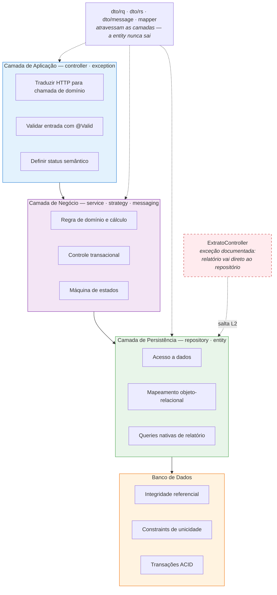
```mermaid
flowchart TB
    subgraph L1["Camada de Aplicação — controller · exception"]
        direction LR
        L1A["Traduzir HTTP para chamada de domínio"]
        L1B["Validar entrada com @Valid"]
        L1C["Definir status semântico"]
    end

    subgraph L2["Camada de Negócio — service · strategy · messaging"]
        direction LR
        L2A["Regra de domínio e cálculo"]
        L2B["Controle transacional"]
        L2C["Máquina de estados"]
    end

    subgraph L3["Camada de Persistência — repository · entity"]
        direction LR
        L3A["Acesso a dados"]
        L3B["Mapeamento objeto-relacional"]
        L3C["Queries nativas de relatório"]
    end

    subgraph L4["Banco de Dados"]
        direction LR
        L4A["Integridade referencial"]
        L4B["Constraints de unicidade"]
        L4C["Transações ACID"]
    end

    DTO["dto/rq · dto/rs · dto/message · mapper<br/><i>atravessam as camadas — a entity nunca sai</i>"]

    L1 --> L2 --> L3 --> L4
    DTO -.-> L1
    DTO -.-> L2
    DTO -.-> L3

    EXC["ExtratoController<br/><i>exceção documentada:<br/>relatório vai direto ao repositório</i>"]
    EXC -.->|"salta L2"| L3

    style L1 fill:#e3f2fd,stroke:#1976d2
    style L2 fill:#f3e5f5,stroke:#7b1fa2
    style L3 fill:#e8f5e9,stroke:#43a047
    style L4 fill:#fff3e0,stroke:#ef6c00
    style EXC fill:#ffebee,stroke:#c62828,stroke-dasharray: 5 5
```

### Leitura do diagrama e responsabilidades

| Camada | Faz | Não faz |
|---|---|---|
| **Aplicação** | Recebe HTTP, valida com `@Valid`, delega, define status | Regra de negócio, acesso a repositório, uso de entity |
| **Negócio** | Calcula, orquestra, controla transação e estado | Conhecer HTTP, conhecer AMQP diretamente, montar SQL |
| **Persistência** | Consulta e grava, mapeia ORM, SQL nativo de relatório | Decidir regra de negócio |
| **Banco** | Garante integridade e atomicidade | — |

**Regras aplicadas:**

- Controller depende de **interface** de serviço, nunca de `Impl`.
- Entity **nunca** é corpo de request nem de response — evita *mass assignment* e vazamento de `version`.
- `@Transactional` em toda escrita multi-etapa.
- `open-in-view=false`: sessão JPA não fica aberta na renderização, forçando decisão explícita de carregamento.
- **Uma exceção**: o extrato salta a camada de negócio. Documentada, não acidental.

### Benefícios

- Dependência unidirecional, sem ciclo.
- Testabilidade: cada camada é testada isoladamente com mock da adjacente — 179 dos 204 testes rodam sem contexto Spring.
- A exceção à regra é única e visível.

### Limitações

- Camadas horizontais espalham mudança de feature por três pacotes.
- Não é arquitetura hexagonal: o domínio conhece anotações JPA, então não é framework-agnóstico.

### Possíveis melhorias

- Se o domínio crescer, avaliar organização por *feature slice* em vez de camada técnica.
- Para isolar o domínio do JPA, seria necessário separar modelo de domínio de modelo de persistência — custo alto, benefício questionável nesta escala.

---

## 13. Strategy Pattern

### Objetivo

Mostrar como o cálculo de deságio varia por tipo de recebível sem duplicar a fórmula.

### Quando utilizar

Ao adicionar tipo de recebível, ou ao alterar a fórmula do valor presente.

### Explicação

O padrão responde a uma pergunta concreta: **onde mora o spread?** A resposta é: na strategy. E a fórmula mora no service, uma vez só.

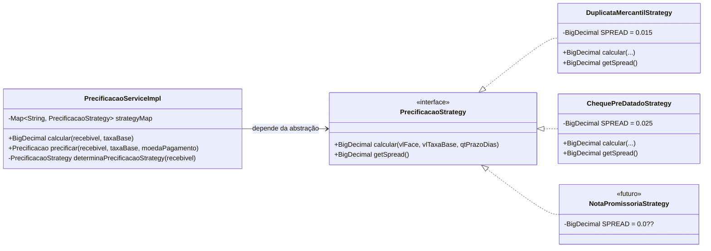
```mermaid
classDiagram
    direction LR

    class PrecificacaoServiceImpl {
        -Map~String, PrecificacaoStrategy~ strategyMap
        +BigDecimal calcular(recebivel, taxaBase)
        +Precificacao precificar(recebivel, taxaBase, moedaPagamento)
        -PrecificacaoStrategy determinaPrecificacaoStrategy(recebivel)
    }

    class PrecificacaoStrategy {
        <<interface>>
        +BigDecimal calcular(vlFace, vlTaxaBase, qtPrazoDias)
        +BigDecimal getSpread()
    }

    class DuplicataMercantilStrategy {
        -BigDecimal SPREAD = 0.015
        +BigDecimal calcular(...)
        +BigDecimal getSpread()
    }

    class ChequePreDatadoStrategy {
        -BigDecimal SPREAD = 0.025
        +BigDecimal calcular(...)
        +BigDecimal getSpread()
    }

    class NotaPromissoriaStrategy {
        <<futuro>>
        -BigDecimal SPREAD = 0.0??
    }

    PrecificacaoServiceImpl --> PrecificacaoStrategy : depende da abstração
    PrecificacaoStrategy <|.. DuplicataMercantilStrategy
    PrecificacaoStrategy <|.. ChequePreDatadoStrategy
    PrecificacaoStrategy <|.. NotaPromissoriaStrategy
```

### Fluxo de resolução

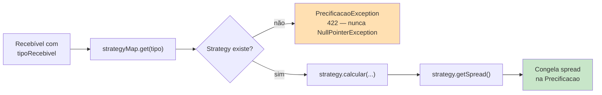
```mermaid
flowchart LR
    A["Recebível com<br/>tipoRecebivel"] --> B["strategyMap.get(tipo)"]
    B --> C{"Strategy existe?"}
    C -->|não| D["PrecificacaoException<br/>422 — nunca NullPointerException"]
    C -->|sim| E["strategy.calcular(...)"]
    E --> F["strategy.getSpread()"]
    F --> G["Congela spread<br/>na Precificacao"]
    style D fill:#ffe0b2
    style G fill:#c8e6c9
```

### Leitura dos diagramas

- **`strategyMap`** resolve por `String` do tipo, alimentada pela tabela `recebivel_tipo`. Adicionar produto = nova entrada no mapa + nova classe + linha na migration.
- **`getSpread()` não é acessório.** Sem ele o service calcula o valor mas **não sabe qual spread foi aplicado**, e não consegue congelá-lo. O snapshot histórico ficaria incompleto e a auditoria impossível.
- **Falha explícita**: tipo sem strategy lança exceção de domínio, não `NullPointerException`. Falha de configuração de produto é erro comunicável.
- **`NotaPromissoriaStrategy`** aparece como classe futura para ilustrar o ponto de extensão.

### Open/Closed Principle

O `PrecificacaoServiceImpl` está **fechado para modificação** e **aberto para extensão**:

| Mudança | Toca o service? |
|---|---|
| Novo tipo de recebível | **Não** — nova strategy + entrada no mapa |
| Alterar spread de um tipo | **Não** — constante da strategy |
| Alterar a fórmula do VP | **Sim** — mas em um lugar só, para todos os tipos |

A assimetria é intencional: a fórmula é invariante do domínio (desconto composto), o spread é política comercial variável.

### Benefícios

- Zero duplicação da fórmula.
- Spread versionado em código, com trilha no Git.
- Cada strategy é testável isoladamente — valores fixados: `9308.9520` para duplicata, `9050.5086` para cheque.

### Limitações

- **Mudança de spread exige deploy.** Aceito: política de risco não deve ser editável em runtime sem trilha de auditoria.
- `strategyMap` é construído com `new` no service, não injetado pelo Spring — strategy não pode ter dependência injetada.
- O mapa é acoplado à `String` do tipo; erro de digitação só aparece em runtime.

### Possíveis melhorias

- Registrar strategies como beans e injetar `Map<String, PrecificacaoStrategy>` — o Spring popula automaticamente, e strategies podem ter dependências.
- Teste que garante que todo `recebivel_tipo` da `V2` tem strategy correspondente, transformando erro de runtime em falha de build.
- Se a área de risco exigir spread dinâmico, avaliar tabela com versionamento temporal (`vigencia_inicio`/`vigencia_fim`), preservando o snapshot.

---

## 14. Fluxo das Exceções

### Objetivo

Mapear cada exceção ao status HTTP e mostrar o caminho até a resposta.

### Quando utilizar

Ao adicionar exceção nova, ou ao investigar status HTTP inesperado.

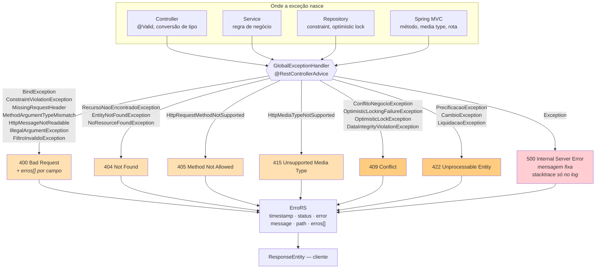
```mermaid
flowchart TB
    subgraph origem["Onde a exceção nasce"]
        O1["Controller<br/>@Valid, conversão de tipo"]
        O2["Service<br/>regra de negócio"]
        O3["Repository<br/>constraint, optimistic lock"]
        O4["Spring MVC<br/>método, media type, rota"]
    end

    O1 --> GEH{{"GlobalExceptionHandler<br/>@RestControllerAdvice"}}
    O2 --> GEH
    O3 --> GEH
    O4 --> GEH

    GEH -->|"BindException<br/>ConstraintViolationException<br/>MissingRequestHeader<br/>MethodArgumentTypeMismatch<br/>HttpMessageNotReadable<br/>IllegalArgumentException<br/>FiltroInvalidoException"| R400["400 Bad Request<br/><i>+ erros[] por campo</i>"]
    GEH -->|"RecursoNaoEncontradoException<br/>EntityNotFoundException<br/>NoResourceFoundException"| R404["404 Not Found"]
    GEH -->|"HttpRequestMethodNotSupported"| R405["405 Method Not Allowed"]
    GEH -->|"HttpMediaTypeNotSupported"| R415["415 Unsupported Media Type"]
    GEH -->|"ConflitoNegocioException<br/>OptimisticLockingFailureException<br/>OptimisticLockException<br/>DataIntegrityViolationException"| R409["409 Conflict"]
    GEH -->|"PrecificacaoException<br/>CambioException<br/>LiquidacaoException"| R422["422 Unprocessable Entity"]
    GEH -->|"Exception"| R500["500 Internal Server Error<br/><i>mensagem fixa</i><br/><i>stacktrace só no log</i>"]

    R400 --> RS["ErroRS<br/>timestamp · status · error<br/>message · path · erros[]"]
    R404 --> RS
    R405 --> RS
    R415 --> RS
    R409 --> RS
    R422 --> RS
    R500 --> RS
    RS --> CLI["ResponseEntity — cliente"]

    style R400 fill:#ffe0b2
    style R404 fill:#ffe0b2
    style R405 fill:#ffe0b2
    style R415 fill:#ffe0b2
    style R409 fill:#ffcc80
    style R422 fill:#ffcc80
    style R500 fill:#ffcdd2
```

### Leitura do diagrama

**Corpo único** (`ErroRS`) para todos os status: `timestamp`, `status`, `error`, `message`, `path`, mais `erros[]` nas validações. Nunca stacktrace.

**Duas exceções foram criadas para desambiguar status.** As de domínio estavam sendo usadas para "não encontrado", "conflito" e "regra violada" ao mesmo tempo — um tipo não carrega três status. Entraram `RecursoNaoEncontradoException` (404) e `ConflitoNegocioException` (409).

**405 e 415 têm handler próprio de propósito.** O catch-all de `Exception` os capturaria e transformaria em 500. Sem esses dois handlers, um `GET` em rota de `POST` viraria 500.

**O 500 devolve mensagem fixa**, não `e.getMessage()`. Só exceções de domínio propagam texto — que é escrito para o cliente. `server.error.include-stacktrace=never` fecha o vazamento que o `devtools` abre por padrão.

**`FiltroInvalidoException` existe por um motivo específico.** Lançar `IllegalArgumentException` de dentro de um `@Repository` faz o `PersistenceExceptionTranslationInterceptor` convertê-la em `InvalidDataAccessApiUsageException` — e o handler nunca a vê como erro de cliente, devolvendo **500 em vez de 400**. Um tipo próprio atravessa o interceptor intacto.

### Benefícios

- Tratamento centralizado: nenhum `try/catch` de apresentação espalhado.
- Status semântico correto sem inspecionar texto de mensagem.
- Detalhe interno nunca vaza — verificado por teste que asserta `doesNotContain`.

### Limitações

- `IllegalArgumentException` mapeada globalmente para 400 pode mascarar bug interno. Mitigado por log em `WARN`.
- Adicionar exceção nova exige lembrar de registrá-la no handler.

### Possíveis melhorias

- Adotar `ProblemDetail` (RFC 7807), padrão do Spring 6+, em vez de corpo próprio.
- Código de erro de negócio (`SRM-001`) além da mensagem, permitindo tratamento programático pelo cliente.
- Correlação: incluir `trackId` no corpo de erro quando disponível.

---

## 15. Fluxo do Banco de Dados e ACID

### Objetivo

Mostrar onde as transações começam e terminam, e como cada propriedade ACID é garantida.

### Quando utilizar

Ao investigar dado parcialmente gravado, ou ao alterar escopo transacional.

```mermaid
flowchart TB
    subgraph intake["Transação de Intake — @Transactional"]
        I1["BEGIN"] --> I2["INSERT cedente<br/><i>se não existir</i>"]
        I2 --> I3["INSERT lote"]
        I3 --> I4["INSERT recebivel<br/><i>por item</i>"]
        I4 --> I5["INSERT precificacao<br/><i>por item</i>"]
        I5 --> I6{"Todos os itens<br/>processados?"}
        I6 -->|não| I4
        I6 -->|sim| I7["COMMIT"]
        I5 -.->|"qualquer exceção"| I8["ROLLBACK<br/><i>nada sobrevive</i>"]
    end

    subgraph liq["Transação de Liquidação — @Transactional"]
        L1["BEGIN"] --> L2["SELECT findByTrackId<br/><i>guard de replay</i>"]
        L2 --> L3["SELECT precificacao"]
        L3 --> L4["SELECT existsByPrecificacaoId<br/><i>guard 1:1</i>"]
        L4 --> L5["INSERT liquidacao PENDENTE<br/><i>version = 0</i>"]
        L5 --> L6["COMMIT"]
        L6 --> L7["AFTER_COMMIT<br/>publica evento"]
    end

    subgraph proc["Transações do Consumidor"]
        P1["BEGIN"] --> P2["SELECT liquidacao"]
        P2 --> P3{"status é<br/>PENDENTE?"}
        P3 -->|não| P4["no-op — COMMIT vazio"]
        P3 -->|sim| P5["UPDATE ... SET status = PROCESSANDO,<br/>version = version + 1<br/>WHERE id = ? AND version = ?"]
        P5 --> P6{"linhas<br/>afetadas?"}
        P6 -->|zero| P7["OptimisticLockException<br/>409"]
        P6 -->|uma| P8["COMMIT"]
        P8 --> P9["BEGIN — nova transação"]
        P9 --> P10["SELECT + converter"]
        P10 --> P11["UPDATE LIQUIDADA<br/>version = version + 1"]
        P11 --> P12["COMMIT"]
    end

    style I8 fill:#ffcdd2
    style I7 fill:#c8e6c9
    style L6 fill:#c8e6c9
    style P7 fill:#ffe0b2
    style P12 fill:#c8e6c9
```

### Como cada propriedade ACID é garantida

**Atomicidade.** `@Transactional` no `LoteService.criar`. Falha em qualquer recebível reverte cedente, lote e todos os itens anteriores. Verificado por teste de integração que compara contagens antes e depois de uma falha proposital no segundo item.

**Consistência.** Constraints no banco, não só no código:
- `UNIQUE (track_id)` e `UNIQUE (precificacao_id)`
- `CHECK (st_liquidacao IN (...))`
- FKs em todas as relações
- `ddl-auto=validate` impede divergência entre entidade e schema

**Isolamento.** InnoDB opera em `REPEATABLE READ` por padrão. Sobre isso, o `@Version` adiciona optimistic locking na `Liquidacao`: o `UPDATE` carrega `WHERE version = ?`, e zero linhas afetadas significa que outra transação já alterou o registro. Testado com threads reais — a transação que carregou a versão obsoleta falha, e `version` avança exatamente uma vez.

**Durabilidade.** InnoDB com `redo log`; volume `mysql_data` persistente no Compose.

### Detalhes que o diagrama revela

- **O intake é uma transação longa**, proporcional ao número de itens. Locks ficam abertos durante todo o loop.
- **A liquidação usa três transações separadas**: criação, `processaLiquidacao`, `finalizaLiquidacao`. Isso é intencional — se `finalizaLiquidacao` falha, o `PROCESSANDO` já commitado permite ao retry seguir de onde parou, sem precisar da transição `FALHA → PROCESSANDO`.
- **`AFTER_COMMIT` está fora da transação.** É a origem do *dual-write*: banco commitado, mensagem ainda não enviada.
- **Guard de estado antes do UPDATE** (`P3`): protege contra reentrada de mensagem duplicada, que causaria conversão de câmbio em dobro.

### Benefícios

- Atomicidade real onde o negócio exige.
- Concorrência controlada com custo mínimo — `@Version` em uma única tabela.
- Três camadas de proteção contra duplicidade: replay, guard em código, constraint no banco.

### Limitações

- Transação de intake longa em lote grande.
- *Dual-write* entre banco e broker.
- Contenção **transitória** é reprocessada pelo `@Retryable` (ADR-010); contenção **persistente** propaga como 409 — por decisão, retry não esconde problema real.

### Possíveis melhorias

- Outbox pattern.
- `@Retryable` em `OptimisticLockException` para reprocessar automaticamente.
- Chunk transacional em lotes grandes.

---

## 16. Deployment Diagram

### Objetivo

Mostrar onde cada peça executa e como se comunicam em runtime.

### Quando utilizar

Ao planejar deploy, dimensionar recurso, ou desenhar a topologia de produção.

### Explicação

O diagrama tem duas partes: **o que existe hoje** (Compose local) e **o que seria produção**. A separação é explícita para não sugerir maturidade que o projeto não tem.

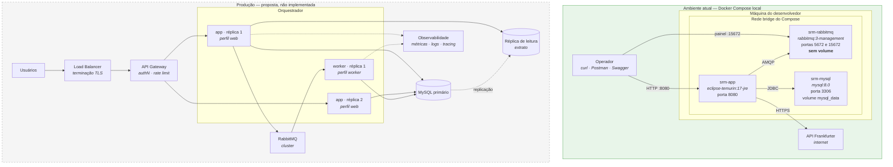
```mermaid
flowchart TB
    subgraph hoje["Ambiente atual — Docker Compose local"]
        DEV["Operador<br/><i>curl · Postman · Swagger</i>"]
        subgraph host["Máquina do desenvolvedor"]
            subgraph net["Rede bridge do Compose"]
                C1["srm-app<br/><i>eclipse-temurin:17-jre</i><br/>porta 8080"]
                C2["srm-mysql<br/><i>mysql:8.0</i><br/>porta 3306<br/>volume mysql_data"]
                C3["srm-rabbitmq<br/><i>rabbitmq:3-management</i><br/>portas 5672 e 15672<br/><b>sem volume</b>"]
            end
        end
        EXT1["API Frankfurter<br/><i>internet</i>"]

        DEV -->|"HTTP :8080"| C1
        DEV -->|"painel :15672"| C3
        C1 -->|JDBC| C2
        C1 -->|AMQP| C3
        C1 -->|HTTPS| EXT1
    end

    subgraph prod["Produção — proposta, não implementada"]
        U["Usuários"]
        LB["Load Balancer<br/><i>terminação TLS</i>"]
        GW["API Gateway<br/><i>authN · rate limit</i>"]
        subgraph k8s["Orquestrador"]
            A1["app · réplica 1<br/><i>perfil web</i>"]
            A2["app · réplica 2<br/><i>perfil web</i>"]
            W1["worker · réplica 1<br/><i>perfil worker</i>"]
        end
        DBP[("MySQL primário")]
        DBR[("Réplica de leitura<br/><i>extrato</i>")]
        MQP["RabbitMQ<br/><i>cluster</i>"]
        OBS["Observabilidade<br/><i>métricas · logs · tracing</i>"]

        U --> LB --> GW
        GW --> A1
        GW --> A2
        A1 --> DBP
        A2 --> DBP
        A1 --> DBR
        A1 --> MQP
        MQP --> W1
        W1 --> DBP
        DBP -.->|replicação| DBR
        A1 -.-> OBS
        W1 -.-> OBS
    end

    style hoje fill:#e8f5e9,stroke:#43a047
    style prod fill:#f5f5f5,stroke:#999,stroke-dasharray: 5 5
```

### Leitura do diagrama

**Ambiente atual:**
- Imagem final em **JRE**, não JDK — Maven e ferramental de build não vão para runtime.
- `depends_on: service_healthy` nos dois serviços de infraestrutura.
- **RabbitMQ sem volume**: fila recriada a cada `up`. Aceitável em desenvolvimento, inaceitável em produção.
- Sem healthcheck no `app` — depende do Actuator, ausente.

**Produção proposta:**
- **Separação `web`/`worker`**: mesmo artefato, perfis Spring distintos. Permite escalar API e processamento independentemente.
- **Réplica de leitura** para o extrato: `@Transactional(readOnly = true)` já está marcado, falta o roteamento de datasource.
- **Gateway** concentra autenticação e rate limiting — o `POST /cambios/sincronizar` chama API externa e é candidato natural a abuso.
- **Observabilidade** pontilhada porque não existe: sem Actuator, sem métricas, sem tracing.

### Benefícios

- Ambiente completo em um comando.
- Aplicação *stateless*: escalar horizontalmente não exige coordenação.
- Consumidor idempotente: aumentar réplicas de worker é seguro.

### Limitações

- Ponto único de falha em todos os componentes.
- Credenciais em texto claro no `application.properties` (`srm`/`srm`, `guest`/`guest`).
- Sem TLS, sem autenticação, sem rate limiting.
- Producer e consumer no mesmo processo impedem escala independente.

### Possíveis melhorias

- Secret manager (Vault, AWS Secrets Manager).
- Perfis `web`/`worker`.
- Cluster RabbitMQ com filas espelhadas.
- Actuator com liveness e readiness, integrado ao healthcheck do orquestrador.

---

## 17. Fluxo HTTP

### Objetivo

Catalogar todos os endpoints com verbo, status possíveis e semântica.

### Quando utilizar

Como referência rápida de contrato, e ao integrar um cliente.

### Explicação

> **Divergência:** o prompt pede `GET`, `POST`, `PUT`, `DELETE` e `PATCH`. **A API tem apenas `GET` e `POST`** — 7 endpoints. Isso não é omissão, é consequência do domínio: **nada é atualizado ou removido**. Liquidação é imutável por design (auditoria financeira), precificação carrega snapshot histórico, e cotação é upsert idempotente, não `PUT`. O cancelamento — que seria o candidato natural a `DELETE` — existe na máquina de estados como `CANCELADA`, mas **nenhum endpoint o produz**.

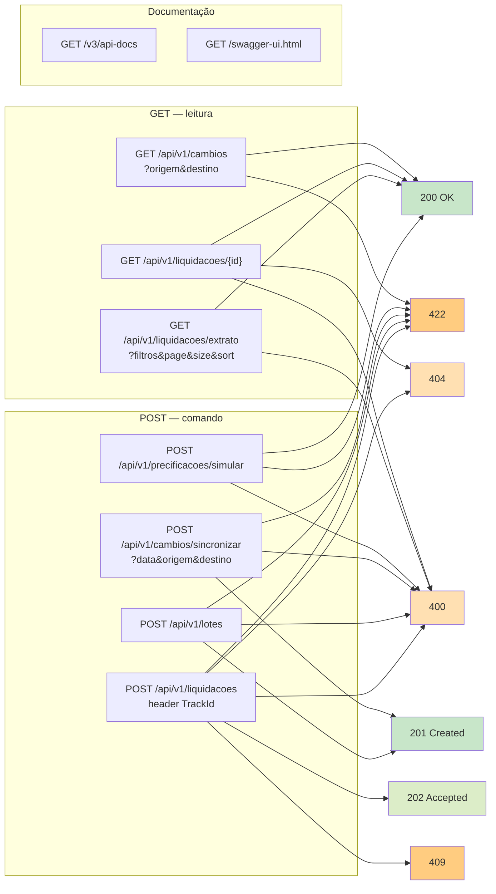
```mermaid
flowchart LR
    subgraph get["GET — leitura"]
        G1["GET /api/v1/cambios<br/>?origem&destino"]
        G2["GET /api/v1/liquidacoes/{id}"]
        G3["GET /api/v1/liquidacoes/extrato<br/>?filtros&page&size&sort"]
    end

    subgraph post["POST — comando"]
        P1["POST /api/v1/precificacoes/simular"]
        P2["POST /api/v1/cambios/sincronizar<br/>?data&origem&destino"]
        P3["POST /api/v1/lotes"]
        P4["POST /api/v1/liquidacoes<br/>header TrackId"]
    end

    subgraph docs["Documentação"]
        D1["GET /v3/api-docs"]
        D2["GET /swagger-ui.html"]
    end

    G1 --> S200["200 OK"]
    G2 --> S200
    G3 --> S200
    P1 --> S200
    P2 --> S201["201 Created"]
    P3 --> S201
    P4 --> S202["202 Accepted"]

    G1 --> S422["422"]
    G2 --> S404["404"]
    G2 --> S400["400"]
    G3 --> S400
    P1 --> S400
    P1 --> S422
    P2 --> S400
    P2 --> S422
    P3 --> S400
    P3 --> S422
    P4 --> S400
    P4 --> S404
    P4 --> S409["409"]
    P4 --> S422

    style S200 fill:#c8e6c9
    style S201 fill:#c8e6c9
    style S202 fill:#dcedc8
    style S400 fill:#ffe0b2
    style S404 fill:#ffe0b2
    style S409 fill:#ffcc80
    style S422 fill:#ffcc80
```

### Catálogo completo

| Verbo | Rota | Sucesso | Erros possíveis | Idempotente? |
|---|---|---|---|---|
| `POST` | `/precificacoes/simular` | `200` | `400`, `422` | Sim — não persiste |
| `POST` | `/cambios/sincronizar` | `201` | `400`, `422` | **Sim** — upsert por par + data |
| `GET` | `/cambios` | `200` | `400`, `422` | Sim |
| `POST` | `/lotes` | `201` | `400`, `422` | **Não** — cria lote novo a cada chamada |
| `POST` | `/liquidacoes` | `202` | `400`, `404`, `409`, `422` | **Sim** — por `TrackId` |
| `GET` | `/liquidacoes/{id}` | `200` | `400`, `404` | Sim |
| `GET` | `/liquidacoes/extrato` | `200` | `400` | Sim |

**Status transversais**, aplicáveis a qualquer rota: `405` (verbo errado), `415` (content-type não JSON), `500` (falha inesperada, mensagem fixa).

**Semântica dos códigos escolhidos:**

- **`201` em `sincronizar`**, ainda que possa atualizar: o recurso "cotação daquele par naquela data" passa a existir de forma consultável. Alternativa mais rigorosa seria `200` no update — não distinguido de propósito, para manter o contrato simples.
- **`202` em `liquidacoes`**: correto para processamento assíncrono. O recurso foi aceito, não concluído.
- **`409` vs `422`**: `409` é conflito com o **estado atual** (já liquidada); `422` é payload sintaticamente válido que viola **regra de negócio** (moeda inexistente, prazo inválido).
- **`400` vs `422`**: `400` é falha de forma (campo ausente, tipo errado, JSON malformado); `422` é falha de conteúdo.

### Benefícios

- Superfície pequena e previsível — 7 endpoints.
- Idempotência explícita onde importa.
- Distinção consistente entre `400`, `409` e `422`.

### Limitações

- `202` obriga polling: sem webhook nem SSE.
- Ausência de `DELETE`/`PATCH` significa que cancelamento e correção exigiriam endpoints novos.
- `POST /lotes` não é idempotente — reenvio duplica o lote.

### Possíveis melhorias

- `POST /liquidacoes/{id}/cancelar` para alcançar `CANCELADA`.
- `Idempotency-Key` também em `POST /lotes`.
- Renomear o header `TrackId` para `Idempotency-Key`, termo de mercado.
- Webhook de notificação do desfecho.

---

## 18. Fluxo da Simulação

### Objetivo

Detalhar o caminho de decisão do cálculo, isolado de persistência.

### Quando utilizar

Ao validar regra de precificação, ou ao explicar o cálculo a área de negócio.

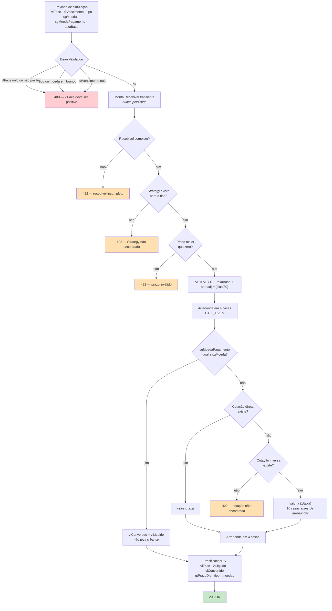
```mermaid
flowchart TB
    A["Payload de simulação<br/>vlFace · dtVencimento · tipo<br/>sgMoeda · sgMoedaPagamento · taxaBase"] --> B{"Bean Validation"}
    B -->|"vlFace nulo ou não positivo"| E400["400 — vlFace deve ser positivo"]
    B -->|"tipo ou moeda em branco"| E400
    B -->|"dtVencimento nula"| E400
    B -->|ok| C["Monta Recebivel transiente<br/><i>nunca persistido</i>"]
    C --> D{"Recebível completo?"}
    D -->|não| E422A["422 — recebível incompleto"]
    D -->|sim| F{"Strategy existe<br/>para o tipo?"}
    F -->|não| E422B["422 — Strategy não encontrada"]
    F -->|sim| G{"Prazo maior<br/>que zero?"}
    G -->|não| E422C["422 — prazo inválido"]
    G -->|sim| H["VP = VF / (1 + taxaBase + spread) ^ (dias/30)"]
    H --> I["Arredonda em 4 casas<br/>HALF_EVEN"]
    I --> J{"sgMoedaPagamento<br/>igual a sgMoeda?"}
    J -->|sim| K["vlConvertido = vlLiquido<br/><i>não toca o banco</i>"]
    J -->|não| L{"Cotação direta<br/>existe?"}
    L -->|sim| M["valor x taxa"]
    L -->|não| N{"Cotação inversa<br/>existe?"}
    N -->|sim| O["valor x (1/taxa)<br/><i>10 casas antes de arredondar</i>"]
    N -->|não| E422D["422 — cotação não encontrada"]
    M --> P["Arredonda em 4 casas"]
    O --> P
    K --> Q["PrecificacaoRS<br/>vlFace · vlLiquido · vlConvertido<br/>qtPrazoDia · tipo · moedas"]
    P --> Q
    Q --> R["200 OK"]

    style E400 fill:#ffcdd2
    style E422A fill:#ffe0b2
    style E422B fill:#ffe0b2
    style E422C fill:#ffe0b2
    style E422D fill:#ffe0b2
    style R fill:#c8e6c9
```

### Leitura do diagrama

- **Dois níveis de validação**: Bean Validation no controller (forma → 400) e validação de domínio no service (conteúdo → 422). A separação é o que permite status semântico correto.
- **`C`: entidade transiente.** Montada para reaproveitar validação e cálculo, nunca persistida. É por isso que a validação de moeda existe só em `precificar`, não em `calcular` — o recebível transiente tem moeda nula por construção.
- **`H`: prazo em meses** (dias ÷ 30), desconto composto.
- **`I` e `P`: arredondamento em 4 casas com `HALF_EVEN`.** Acontece **por chamada** — o que significa que `2 × round(x)` pode diferir de `round(2x)` em uma unidade da última casa. Comportamento documentado por teste.
- **`O`: taxa inversa com 10 casas** antes do arredondamento final, para não perder precisão na divisão.
- **`K`: curto-circuito de mesma moeda** — não consulta o banco.

### Benefícios

- Nenhum efeito colateral: seguro para explorar cenários.
- Mesmo código do fluxo persistido — simulação e execução não podem divergir.
- Quatro portas de 422 distintas, cada uma com mensagem específica.

### Limitações

- Simulação não é registrada — sem histórico do que foi cotado.
- Requer cotação previamente sincronizada.

### Possíveis melhorias

- Persistir simulações para auditoria comercial.
- Simulação em lote, comparando cenários.
- Devolver a decomposição do deságio (quanto é taxa base, quanto é spread) para transparência ao cedente.

---

## 19. Fluxo da Liquidação

### Objetivo

Mostrar a jornada do estado da liquidação, do enfileiramento ao extrato.

### Quando utilizar

Ao investigar liquidação em estado inesperado.

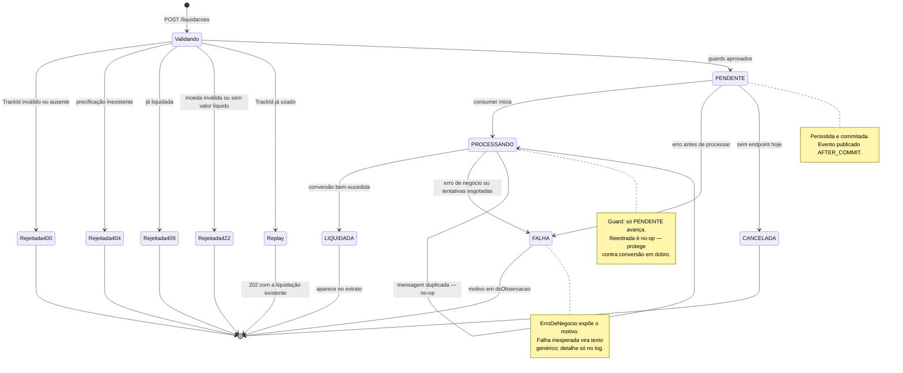
```mermaid
stateDiagram-v2
    [*] --> Validando : POST /liquidacoes

    Validando --> Rejeitada400 : TrackId inválido ou ausente
    Validando --> Rejeitada404 : precificação inexistente
    Validando --> Rejeitada409 : já liquidada
    Validando --> Rejeitada422 : moeda inválida ou sem valor líquido
    Validando --> Replay : TrackId já usado
    Validando --> PENDENTE : guards aprovados

    Replay --> [*] : 202 com a liquidação existente

    PENDENTE --> PROCESSANDO : consumer inicia
    PENDENTE --> FALHA : erro antes de processar
    PENDENTE --> CANCELADA : sem endpoint hoje

    PROCESSANDO --> LIQUIDADA : conversão bem-sucedida
    PROCESSANDO --> FALHA : erro de negócio ou tentativas esgotadas
    PROCESSANDO --> PROCESSANDO : mensagem duplicada — no-op

    LIQUIDADA --> [*] : aparece no extrato
    FALHA --> [*] : motivo em dsObservacao
    CANCELADA --> [*]

    Rejeitada400 --> [*]
    Rejeitada404 --> [*]
    Rejeitada409 --> [*]
    Rejeitada422 --> [*]

    note right of PENDENTE
        Persistida e commitada.
        Evento publicado AFTER_COMMIT.
    end note

    note right of PROCESSANDO
        Guard: só PENDENTE avança.
        Reentrada é no-op — protege
        contra conversão em dobro.
    end note

    note right of FALHA
        ErroDeNegocio expõe o motivo.
        Falha inesperada vira texto
        genérico; detalhe só no log.
    end note
```

### Leitura do diagrama

- **`Validando`** concentra os quatro guards antes de qualquer escrita. O `Replay` é verificado primeiro, porque reenvio é caso esperado.
- **`PENDENTE → CANCELADA`** existe na máquina de estados e é respeitada pelo consumidor, mas **nenhum endpoint a produz**. Estado modelado sem porta de entrada.
- **`PROCESSANDO → PROCESSANDO`** representa o no-op da mensagem duplicada. Não é transição real — o guard retorna sem gravar.
- **Três estados terminais.** `FALHA` e `CANCELADA` não têm saída, o que significa que **retry a partir da DLQ exigirá uma transição nova** (`FALHA → PROCESSANDO`).
- **Só `LIQUIDADA` alimenta o extrato.**

### Benefícios

- Estados explícitos e validados em um ponto único do service.
- Transição ilegítima lança `ConflitoNegocioException` → 409, em vez de corromper estado.
- Matriz completa de transições coberta por 41 testes parametrizados.

### Limitações

- `CANCELADA` inalcançável pela API.
- Estados terminais impedem reprocessamento.
- Sem histórico de transições: apenas o estado atual e `dt_atualizacao`.

### Possíveis melhorias

- Endpoint de cancelamento.
- Transição `FALHA → PROCESSANDO` para replay da DLQ.
- Tabela de auditoria de transições (`liquidacao_historico`), registrando quem mudou o que e quando.

---

## 20. Arquitetura Completa

### Objetivo

Reunir toda a solução em um diagrama único, do cliente ao banco.

### Quando utilizar

Como diagrama de referência único, em apresentação executiva ou capa de documentação.

```mermaid
flowchart TB
    subgraph clientes["Clientes"]
        OP["Operador<br/>curl · Postman"]
        SPA["SPA Angular<br/><i>planejada</i>"]
        SW["Swagger UI<br/>/swagger-ui.html"]
    end

    GW["API Gateway<br/><i>não implementado</i><br/>authN · TLS · rate limit"]

    subgraph app["Aplicação Spring Boot — Java 17"]
        subgraph webl["Web"]
            CTRL["5 Controllers<br/>7 endpoints REST"]
            GEH["GlobalExceptionHandler<br/>ErroRS padronizado"]
        end
        subgraph negl["Negócio"]
            PSVC["PrecificacaoService"]
            STRAT["Strategy<br/>Duplicata 1,5% · Cheque 2,5%"]
            CSVC["CambioService"]
            LSVC["LoteService"]
            QSVC["LiquidacaoService"]
            FSM["StatusLiquidacao<br/>máquina de estados"]
        end
        subgraph msgl["Mensageria"]
            PROD["Producer<br/>@TransactionalEventListener"]
            CONS["Consumer<br/>@RabbitListener"]
            RECOV["MessageRecoverer"]
        end
        subgraph datal["Dados"]
            REPO["8 Repositories JPA"]
            EXTR["ExtratoRepository<br/>SQL nativo"]
            HTTPC["CambioClient<br/>RestClient"]
        end
    end

    subgraph infra["Infraestrutura — Docker Compose"]
        MQ["RabbitMQ 3<br/>exchange · queue · DLX · DLQ"]
        DB[("MySQL 8<br/>8 tabelas · Flyway V1-V3")]
    end

    FRK["API Frankfurter<br/><i>cotações</i>"]

    OP --> CTRL
    SW -.-> CTRL
    SPA -.-> GW
    GW -.-> CTRL

    CTRL --> PSVC
    CTRL --> CSVC
    CTRL --> LSVC
    CTRL --> QSVC
    CTRL --> EXTR
    GEH -.-> CTRL

    LSVC --> PSVC
    PSVC --> STRAT
    PSVC --> CSVC
    QSVC --> CSVC
    QSVC --> FSM
    CSVC --> HTTPC
    HTTPC --> FRK

    QSVC -.->|evento| PROD
    PROD --> MQ
    MQ --> CONS
    CONS --> QSVC
    CONS -.-> RECOV
    RECOV --> MQ

    PSVC --> REPO
    CSVC --> REPO
    LSVC --> REPO
    QSVC --> REPO
    REPO --> DB
    EXTR --> DB

    style clientes fill:#e3f2fd,stroke:#1976d2
    style app fill:#f3e5f5,stroke:#7b1fa2
    style infra fill:#fff3e0,stroke:#ef6c00
    style GW fill:#f5f5f5,stroke:#999,stroke-dasharray: 5 5
    style SPA fill:#f5f5f5,stroke:#999,stroke-dasharray: 5 5
```

### Leitura do diagrama

- **Pontilhados são o que não existe**: SPA e Gateway. Estão presentes para mostrar onde encaixariam, não para sugerir que existem.
- **`CTRL → EXTR`** é a única seta que salta a camada de negócio (extrato).
- **`QSVC -.-> PROD`** é a fronteira do Observer: o service publica evento, não conhece AMQP.
- **`CONS → QSVC`**: o consumidor volta ao mesmo service. Nenhuma regra de negócio duplicada no consumidor.
- **`RECOV → MQ`**: o recoverer republica na DLX após esgotar as tentativas.
- **`HTTPC → FRK`** é a única dependência externa, e a única síncrona fora do banco.

### Benefícios

- Visão única sem perder as decisões arquiteturais relevantes.
- Distinção visual entre implementado e planejado.
- Torna visível que o domínio não depende de infraestrutura de mensageria.

### Limitações

- Densidade alta: útil como referência, ruim como primeiro contato — para isso serve o [Diagrama 1](#1-c4--context-diagram).
- Não mostra dados nem volume.
- Não representa observabilidade, porque ela não existe.

### Possíveis melhorias

- Versão anotada com métricas reais (latência por camada) depois de instrumentar.
- Separar em duas visões: caminho síncrono e caminho assíncrono.

---

## Resumo das decisões arquiteturais

| Decisão | Onde aparece | Trade-off aceito |
|---|---|---|
| Liquidação assíncrona (`202`) | [8](#8-sequência--liquidação-assíncrona), [19](#19-fluxo-da-liquidação) | Cliente precisa consultar o desfecho |
| Spread na Strategy | [13](#13-strategy-pattern) | Mudança de spread exige deploy |
| Observer entre domínio e broker | [3](#3-c4--component-diagram), [11](#11-processamento-assíncrono) | Introduz *dual-write* |
| 2 camadas no extrato | [3](#3-c4--component-diagram), [12](#12-arquitetura-em-camadas) | Rompe a regra de camadas, uma vez, documentado |
| Snapshot de spread/taxa/prazo | [4](#4-diagrama-de-classes), [5](#5-diagrama-er) | Redundância de dados em troca de auditabilidade |
| `@Version` só em `Liquidacao` | [4](#4-diagrama-de-classes), [15](#15-fluxo-do-banco-de-dados-e-acid) | Outras entidades sem proteção — não precisam |
| DLQ sem consumidor | [11](#11-processamento-assíncrono) | Exige intervenção manual |
| Falha determinística não retenta | [11](#11-processamento-assíncrono) | Nenhum — evita desperdício |
| Publish `AFTER_COMMIT` | [8](#8-sequência--liquidação-assíncrona), [15](#15-fluxo-do-banco-de-dados-e-acid) | Janela de *dual-write* |

Detalhamento de cada decisão na seção de ADRs do [`README.md`](../../README.md).
